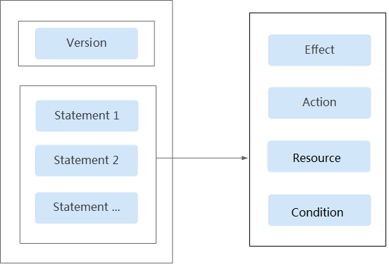

# 策略语法<a name="iam_01_0019"></a>

下面以OBS的自定义策略为例，说明策略的语法。

```
{
    "Version": "1.1",
    "Statement": [
        {
            "Effect": "Allow",
            "Action": [
                "obs:bucket:ListAllMyBuckets",
                "obs:bucket:HeadBucket",
                "obs:bucket:ListBucket",
                "obs:bucket:GetBucketLocation"
            ],
            "Condition": {
                "StringEndWithIfExists": {
                    "g:UserName": [
                        "specialCharactor"
                    ]
                },
                "Bool": {
                    "g:MFAPresent": [
                        "true"
                    ]
                }
            },
            "Resource": [
                "obs:*:*:bucket:*"
            ]
        }
    ]
}
```

## 策略结构<a name="section725321915453"></a>

策略结构包括Version（策略版本号）和Statement（策略权限语句）两部分，其中Statement可以有多个，表示不同的授权项。

**图 1**  策略结构<a name="fig5199186144"></a>  


## 策略参数<a name="section168441547184511"></a>

策略参数包含Version和Statement两部分，下面介绍策略参数详细说明。了解策略参数后，您可以根据场景自定义策略，如[自定义策略使用样例](自定义策略使用样例.md)。

**表 1**  策略参数说明

<a name="table1628145613425"></a>
<table><thead align="left"><tr id="row18281356154218"><th class="cellrowborder" colspan="2" valign="top" id="mcps1.2.5.1.1"><p id="p18808201154318"><a name="p18808201154318"></a><a name="p18808201154318"></a>参数</p>
</th>
<th class="cellrowborder" valign="top" id="mcps1.2.5.1.2"><p id="p9808817432"><a name="p9808817432"></a><a name="p9808817432"></a>含义</p>
</th>
<th class="cellrowborder" valign="top" id="mcps1.2.5.1.3"><p id="p88088112434"><a name="p88088112434"></a><a name="p88088112434"></a>值</p>
</th>
</tr>
</thead>
<tbody><tr id="row152811656154214"><td class="cellrowborder" colspan="2" valign="top" headers="mcps1.2.5.1.1 "><p id="p1169964815313"><a name="p1169964815313"></a><a name="p1169964815313"></a>Version</p>
</td>
<td class="cellrowborder" valign="top" headers="mcps1.2.5.1.2 "><p id="p2080814113433"><a name="p2080814113433"></a><a name="p2080814113433"></a>策略的版本。</p>
</td>
<td class="cellrowborder" valign="top" headers="mcps1.2.5.1.3 "><p id="p148081111433"><a name="p148081111433"></a><a name="p148081111433"></a>1.1：代表基于策略的访问控制。</p>
</td>
</tr>
<tr id="row1428175614422"><td class="cellrowborder" rowspan="4" valign="top" width="15%" headers="mcps1.2.5.1.1 "><p id="p78081014439"><a name="p78081014439"></a><a name="p78081014439"></a>Statement：</p>
<p id="p780871104313"><a name="p780871104313"></a><a name="p780871104313"></a>策略的授权语句</p>
</td>
<td class="cellrowborder" valign="top" width="15%" headers="mcps1.2.5.1.1 "><p id="p168089114434"><a name="p168089114434"></a><a name="p168089114434"></a>Effect：作用</p>
</td>
<td class="cellrowborder" valign="top" width="25%" headers="mcps1.2.5.1.2 "><p id="p18808913433"><a name="p18808913433"></a><a name="p18808913433"></a>定义Action中的操作权限是否允许执行。</p>
</td>
<td class="cellrowborder" valign="top" width="45%" headers="mcps1.2.5.1.3 "><a name="ul18085113439"></a><a name="ul18085113439"></a><ul id="ul18085113439"><li>Allow：允许执行。</li><li>Deny：不允许执行。</li></ul>
<div class="note" id="note58087154315"><a name="note58087154315"></a><a name="note58087154315"></a><span class="notetitle"> 说明： </span><div class="notebody"><p id="p78081213435"><a name="p78081213435"></a><a name="p78081213435"></a>当同一个Action的Effect既有Allow又有Deny时，遵循Deny优先的原则。</p>
</div></div>
</td>
</tr>
<tr id="row428105664210"><td class="cellrowborder" valign="top" headers="mcps1.2.5.1.1 "><p id="p1580815116435"><a name="p1580815116435"></a><a name="p1580815116435"></a>Action：授权项</p>
</td>
<td class="cellrowborder" valign="top" headers="mcps1.2.5.1.1 "><p id="p2080881204317"><a name="p2080881204317"></a><a name="p2080881204317"></a>操作权限。</p>
</td>
<td class="cellrowborder" valign="top" headers="mcps1.2.5.1.2 "><p id="p780811194313"><a name="p780811194313"></a><a name="p780811194313"></a>格式为“服务名:资源类型:操作”。授权项支持通配符号*，通配符号*表示所有。</p>
<p id="p128081134313"><a name="p128081134313"></a><a name="p128081134313"></a>示例：</p>
<p id="p148081115434"><a name="p148081115434"></a><a name="p148081115434"></a>"obs:bucket:ListAllMybuckets"：表示查看OBS桶列表权限，其中obs为服务名，bucket为资源类型，ListAllMybuckets为操作。</p>
<p id="p3500223114318"><a name="p3500223114318"></a><a name="p3500223114318"></a>您可以在对应服务“API参考”资料中查看该服务所有授权项，如<a href="https://support.huaweicloud.com/api-obs/obs_04_0110.html" target="_blank" rel="noopener noreferrer">OBS授权项</a>。</p>
</td>
</tr>
<tr id="row728145644218"><td class="cellrowborder" valign="top" headers="mcps1.2.5.1.1 "><p id="p480871194314"><a name="p480871194314"></a><a name="p480871194314"></a>Condition：条件</p>
</td>
<td class="cellrowborder" valign="top" headers="mcps1.2.5.1.1 "><p id="p1880841194314"><a name="p1880841194314"></a><a name="p1880841194314"></a>使策略生效的特定条件，包括<a href="#li449665115487">条件键</a>和<a href="#li12381923154918">运算符</a>。</p>
</td>
<td class="cellrowborder" valign="top" headers="mcps1.2.5.1.2 "><p id="p13121113515415"><a name="p13121113515415"></a><a name="p13121113515415"></a>格式为“条件运算符:{条件键：[条件值1,条件值2]}”。</p>
<p id="p9808813435"><a name="p9808813435"></a><a name="p9808813435"></a>如果您设置多个条件，同时满足所有条件时，该策略才生效。</p>
<p id="p380811111437"><a name="p380811111437"></a><a name="p380811111437"></a>示例:</p>
<p id="p1380812114431"><a name="p1380812114431"></a><a name="p1380812114431"></a>"StringEndWithIfExists":{"g:UserName":["specialCharactor"]}：表示当用户输入的用户名以"specialCharactor"结尾时该条statement生效。</p>
</td>
</tr>
<tr id="row19281656114220"><td class="cellrowborder" valign="top" headers="mcps1.2.5.1.1 "><p id="p980811114317"><a name="p980811114317"></a><a name="p980811114317"></a>Resource: 资源类型</p>
</td>
<td class="cellrowborder" valign="top" headers="mcps1.2.5.1.1 "><p id="p780811115435"><a name="p780811115435"></a><a name="p780811115435"></a>策略所作用的资源。</p>
</td>
<td class="cellrowborder" valign="top" headers="mcps1.2.5.1.2 "><p id="p108081118435"><a name="p108081118435"></a><a name="p108081118435"></a>格式为“服务名:region:domainId:资源类型:资源路径”, 资源类型支持通配符号*，通配符号*表示所有。支持资源粒度授权的云服务和资源类型参见：<a href="https://support.huaweicloud.com/usermanual-iam/iam_01_0610.html" target="_blank" rel="noopener noreferrer">支持IAM资源粒度授权的云服务</a>。</p>
<p id="p58084114433"><a name="p58084114433"></a><a name="p58084114433"></a>示例：</p>
<a name="ul1980814164316"></a><a name="ul1980814164316"></a><ul id="ul1980814164316"><li>"obs:*:*:bucket:*": 表示所有的OBS桶。</li><li>"obs:*:*:object:my-bucket/my-object/*": 表示my-bucket桶my-object目录下的所有对象。</li></ul>
</td>
</tr>
</tbody>
</table>

-   <a name="li449665115487"></a>**条件键**

    条件键表示策略语句的 Condition 元素中的键值。根据适用范围，分为全局条件键和服务条件键。

    -   全局级条件键（前缀为g:）适用于所有操作，IAM提供两种全局条件键：**通用全局条件键**和**其他全局条件键**。
        -   通用全局条件键：在鉴权过程中，云服务不需要提供用户身份信息，IAM将自动获取并鉴权。详情请参见：[通用全局条件键](#table5817133903114)。
        -   其他全局条件键：在鉴权过程中，IAM通过云服务获取条件信息并鉴权。

    -   服务级条件键（前缀为服务缩写，如obs:）仅适用于对应服务的操作，详情请参见对应云服务的用户指南，如[OBS请求条件](https://support.huaweicloud.com/usermanual-obs/obs_03_0155.html)。

    **表 2**  通用全局条件键

    <a name="table5817133903114"></a>
    <table><thead align="left"><tr id="row58181139183115"><th class="cellrowborder" valign="top" width="18.61%" id="mcps1.2.4.1.1"><p id="p20818153911316"><a name="p20818153911316"></a><a name="p20818153911316"></a>全局条件键</p>
    </th>
    <th class="cellrowborder" valign="top" width="13.84%" id="mcps1.2.4.1.2"><p id="p189831506545"><a name="p189831506545"></a><a name="p189831506545"></a>类型</p>
    </th>
    <th class="cellrowborder" valign="top" width="67.55%" id="mcps1.2.4.1.3"><p id="p18818339133116"><a name="p18818339133116"></a><a name="p18818339133116"></a>说明</p>
    </th>
    </tr>
    </thead>
    <tbody><tr id="row1981833993110"><td class="cellrowborder" valign="top" width="18.61%" headers="mcps1.2.4.1.1 "><p id="p59903284566"><a name="p59903284566"></a><a name="p59903284566"></a>g:CurrentTime</p>
    </td>
    <td class="cellrowborder" valign="top" width="13.84%" headers="mcps1.2.4.1.2 "><p id="p1181853903116"><a name="p1181853903116"></a><a name="p1181853903116"></a>时间</p>
    </td>
    <td class="cellrowborder" valign="top" width="67.55%" headers="mcps1.2.4.1.3 "><p id="p88191139183117"><a name="p88191139183117"></a><a name="p88191139183117"></a>接收到鉴权请求的时间。以 ISO 8601 格式表示，例如：2012-11-11T23:59:59Z</p>
    </td>
    </tr>
    <tr id="row14174174353113"><td class="cellrowborder" valign="top" width="18.61%" headers="mcps1.2.4.1.1 "><p id="p11751143153118"><a name="p11751143153118"></a><a name="p11751143153118"></a>g:DomainName</p>
    </td>
    <td class="cellrowborder" valign="top" width="13.84%" headers="mcps1.2.4.1.2 "><p id="p4175184319318"><a name="p4175184319318"></a><a name="p4175184319318"></a>字符串</p>
    </td>
    <td class="cellrowborder" valign="top" width="67.55%" headers="mcps1.2.4.1.3 "><p id="p12175943133118"><a name="p12175943133118"></a><a name="p12175943133118"></a>帐号名称</p>
    </td>
    </tr>
    <tr id="row781833923113"><td class="cellrowborder" valign="top" width="18.61%" headers="mcps1.2.4.1.1 "><p id="p9818193903118"><a name="p9818193903118"></a><a name="p9818193903118"></a>g:MFAPresent</p>
    </td>
    <td class="cellrowborder" valign="top" width="13.84%" headers="mcps1.2.4.1.2 "><p id="p481883918319"><a name="p481883918319"></a><a name="p481883918319"></a>布尔值</p>
    </td>
    <td class="cellrowborder" valign="top" width="67.55%" headers="mcps1.2.4.1.3 "><p id="p2465122012"><a name="p2465122012"></a><a name="p2465122012"></a>是否使用MFA多因素认证方式获取Token</p>
    </td>
    </tr>
    <tr id="row9784135712414"><td class="cellrowborder" valign="top" width="18.61%" headers="mcps1.2.4.1.1 "><p id="p478485711242"><a name="p478485711242"></a><a name="p478485711242"></a>g:MFAAge</p>
    </td>
    <td class="cellrowborder" valign="top" width="13.84%" headers="mcps1.2.4.1.2 "><p id="p10784657122412"><a name="p10784657122412"></a><a name="p10784657122412"></a>数值</p>
    </td>
    <td class="cellrowborder" valign="top" width="67.55%" headers="mcps1.2.4.1.3 "><p id="p187851657182415"><a name="p187851657182415"></a><a name="p187851657182415"></a>通过MFA多因素认证方式获取的Token的生效时长。该条件需要和g:MFAPresent一起使用</p>
    </td>
    </tr>
    <tr id="row8818739103110"><td class="cellrowborder" valign="top" width="18.61%" headers="mcps1.2.4.1.1 "><p id="p02819137575"><a name="p02819137575"></a><a name="p02819137575"></a>g:ProjectName</p>
    </td>
    <td class="cellrowborder" valign="top" width="13.84%" headers="mcps1.2.4.1.2 "><p id="p3818839143117"><a name="p3818839143117"></a><a name="p3818839143117"></a>字符串</p>
    </td>
    <td class="cellrowborder" valign="top" width="67.55%" headers="mcps1.2.4.1.3 "><p id="p1081853913114"><a name="p1081853913114"></a><a name="p1081853913114"></a>项目名称</p>
    </td>
    </tr>
    <tr id="row1381916391316"><td class="cellrowborder" valign="top" width="18.61%" headers="mcps1.2.4.1.1 "><p id="p18819103920314"><a name="p18819103920314"></a><a name="p18819103920314"></a>g:ServiceName</p>
    </td>
    <td class="cellrowborder" valign="top" width="13.84%" headers="mcps1.2.4.1.2 "><p id="p78191039163115"><a name="p78191039163115"></a><a name="p78191039163115"></a>字符串</p>
    </td>
    <td class="cellrowborder" valign="top" width="67.55%" headers="mcps1.2.4.1.3 "><p id="p157500818596"><a name="p157500818596"></a><a name="p157500818596"></a>服务名称</p>
    </td>
    </tr>
    <tr id="row15819153913111"><td class="cellrowborder" valign="top" width="18.61%" headers="mcps1.2.4.1.1 "><p id="p168199392317"><a name="p168199392317"></a><a name="p168199392317"></a>g:UserId</p>
    </td>
    <td class="cellrowborder" valign="top" width="13.84%" headers="mcps1.2.4.1.2 "><p id="p9819153910312"><a name="p9819153910312"></a><a name="p9819153910312"></a>字符串</p>
    </td>
    <td class="cellrowborder" valign="top" width="67.55%" headers="mcps1.2.4.1.3 "><p id="p1182333923110"><a name="p1182333923110"></a><a name="p1182333923110"></a>IAM用户ID</p>
    </td>
    </tr>
    <tr id="row1082310393314"><td class="cellrowborder" valign="top" width="18.61%" headers="mcps1.2.4.1.1 "><p id="p382363983112"><a name="p382363983112"></a><a name="p382363983112"></a>g:UserName</p>
    </td>
    <td class="cellrowborder" valign="top" width="13.84%" headers="mcps1.2.4.1.2 "><p id="p1882323923114"><a name="p1882323923114"></a><a name="p1882323923114"></a>字符串</p>
    </td>
    <td class="cellrowborder" valign="top" width="67.55%" headers="mcps1.2.4.1.3 "><p id="p138233394313"><a name="p138233394313"></a><a name="p138233394313"></a>IAM用户名</p>
    </td>
    </tr>
    </tbody>
    </table>


-   <a name="li12381923154918"></a>**运算符**

    运算符与条件键、条件值一起构成完整的条件判断语句，当请求信息满足该条件时，策略才能生效，详情请参见：[运算符](#table15992954168)。运算符可以增加后缀“IfExists”，表示对应请求值为空或满足条件的请求值均使策略生效，如“StringEqualsIfExists”表示请求值为空或请求值等于条件值均使策略生效。

    **表 3**  运算符（字符串型运算符，如未增加说明，不区分大小写。）

    <a name="table15992954168"></a>
    <table><thead align="left"><tr id="row399295418618"><th class="cellrowborder" valign="top" width="25%" id="mcps1.2.4.1.1"><p id="p89922541969"><a name="p89922541969"></a><a name="p89922541969"></a>运算符</p>
    </th>
    <th class="cellrowborder" valign="top" width="15%" id="mcps1.2.4.1.2"><p id="p10992354162"><a name="p10992354162"></a><a name="p10992354162"></a>类型</p>
    </th>
    <th class="cellrowborder" valign="top" width="60%" id="mcps1.2.4.1.3"><p id="p18992115410618"><a name="p18992115410618"></a><a name="p18992115410618"></a>说明</p>
    </th>
    </tr>
    </thead>
    <tbody><tr id="row2099213541261"><td class="cellrowborder" valign="top" width="25%" headers="mcps1.2.4.1.1 "><p id="p12633115421016"><a name="p12633115421016"></a><a name="p12633115421016"></a>StringEquals</p>
    </td>
    <td class="cellrowborder" valign="top" width="15%" headers="mcps1.2.4.1.2 "><p id="p914035811113"><a name="p914035811113"></a><a name="p914035811113"></a>字符串</p>
    </td>
    <td class="cellrowborder" valign="top" width="60%" headers="mcps1.2.4.1.3 "><p id="p626583613127"><a name="p626583613127"></a><a name="p626583613127"></a>请求值等于条件值（区分大小写）</p>
    </td>
    </tr>
    <tr id="row29921542068"><td class="cellrowborder" valign="top" width="25%" headers="mcps1.2.4.1.1 "><p id="p4633205411012"><a name="p4633205411012"></a><a name="p4633205411012"></a>StringNotEquals</p>
    </td>
    <td class="cellrowborder" valign="top" width="15%" headers="mcps1.2.4.1.2 "><p id="p494025151217"><a name="p494025151217"></a><a name="p494025151217"></a>字符串</p>
    </td>
    <td class="cellrowborder" valign="top" width="60%" headers="mcps1.2.4.1.3 "><p id="p42651836181215"><a name="p42651836181215"></a><a name="p42651836181215"></a>请求值不等于条件值（区分大小写）</p>
    </td>
    </tr>
    <tr id="row299212541664"><td class="cellrowborder" valign="top" width="25%" headers="mcps1.2.4.1.1 "><p id="p1633185411104"><a name="p1633185411104"></a><a name="p1633185411104"></a>StringEqualsIgnoreCase</p>
    </td>
    <td class="cellrowborder" valign="top" width="15%" headers="mcps1.2.4.1.2 "><p id="p109624521219"><a name="p109624521219"></a><a name="p109624521219"></a>字符串</p>
    </td>
    <td class="cellrowborder" valign="top" width="60%" headers="mcps1.2.4.1.3 "><p id="p11682111414516"><a name="p11682111414516"></a><a name="p11682111414516"></a>请求值等于条件值</p>
    </td>
    </tr>
    <tr id="row119927541365"><td class="cellrowborder" valign="top" width="25%" headers="mcps1.2.4.1.1 "><p id="p963365411106"><a name="p963365411106"></a><a name="p963365411106"></a>StringNotEqualsIgnoreCase</p>
    </td>
    <td class="cellrowborder" valign="top" width="15%" headers="mcps1.2.4.1.2 "><p id="p1998319531210"><a name="p1998319531210"></a><a name="p1998319531210"></a>字符串</p>
    </td>
    <td class="cellrowborder" valign="top" width="60%" headers="mcps1.2.4.1.3 "><p id="p136824149514"><a name="p136824149514"></a><a name="p136824149514"></a>请求值不等于条件值</p>
    </td>
    </tr>
    <tr id="row19992165410610"><td class="cellrowborder" valign="top" width="25%" headers="mcps1.2.4.1.1 "><p id="p15633135410109"><a name="p15633135410109"></a><a name="p15633135410109"></a>StringLike</p>
    </td>
    <td class="cellrowborder" valign="top" width="15%" headers="mcps1.2.4.1.2 "><p id="p39901859127"><a name="p39901859127"></a><a name="p39901859127"></a>字符串</p>
    </td>
    <td class="cellrowborder" valign="top" width="60%" headers="mcps1.2.4.1.3 "><p id="p1126304016519"><a name="p1126304016519"></a><a name="p1126304016519"></a>请求值包含条件值</p>
    </td>
    </tr>
    <tr id="row19929543617"><td class="cellrowborder" valign="top" width="25%" headers="mcps1.2.4.1.1 "><p id="p5633454101011"><a name="p5633454101011"></a><a name="p5633454101011"></a>StringNotLike</p>
    </td>
    <td class="cellrowborder" valign="top" width="15%" headers="mcps1.2.4.1.2 "><p id="p999985111212"><a name="p999985111212"></a><a name="p999985111212"></a>字符串</p>
    </td>
    <td class="cellrowborder" valign="top" width="60%" headers="mcps1.2.4.1.3 "><p id="p13587121660"><a name="p13587121660"></a><a name="p13587121660"></a>请求值不包含条件值</p>
    </td>
    </tr>
    <tr id="row506346105"><td class="cellrowborder" valign="top" width="25%" headers="mcps1.2.4.1.1 "><p id="p16633145461020"><a name="p16633145461020"></a><a name="p16633145461020"></a>StringStartWith</p>
    </td>
    <td class="cellrowborder" valign="top" width="15%" headers="mcps1.2.4.1.2 "><p id="p7719610125"><a name="p7719610125"></a><a name="p7719610125"></a>字符串</p>
    </td>
    <td class="cellrowborder" valign="top" width="60%" headers="mcps1.2.4.1.3 "><p id="p84617151186"><a name="p84617151186"></a><a name="p84617151186"></a>请求值以条件值开头</p>
    </td>
    </tr>
    <tr id="row8063461019"><td class="cellrowborder" valign="top" width="25%" headers="mcps1.2.4.1.1 "><p id="p6633195416103"><a name="p6633195416103"></a><a name="p6633195416103"></a>StringEndWith</p>
    </td>
    <td class="cellrowborder" valign="top" width="15%" headers="mcps1.2.4.1.2 "><p id="p31596131215"><a name="p31596131215"></a><a name="p31596131215"></a>字符串</p>
    </td>
    <td class="cellrowborder" valign="top" width="60%" headers="mcps1.2.4.1.3 "><p id="p2461415888"><a name="p2461415888"></a><a name="p2461415888"></a>请求值以条件值结尾</p>
    </td>
    </tr>
    <tr id="row170123431014"><td class="cellrowborder" valign="top" width="25%" headers="mcps1.2.4.1.1 "><p id="p13633145471019"><a name="p13633145471019"></a><a name="p13633145471019"></a>StringNotStartWith</p>
    </td>
    <td class="cellrowborder" valign="top" width="15%" headers="mcps1.2.4.1.2 "><p id="p1021126121210"><a name="p1021126121210"></a><a name="p1021126121210"></a>字符串</p>
    </td>
    <td class="cellrowborder" valign="top" width="60%" headers="mcps1.2.4.1.3 "><p id="p188257337711"><a name="p188257337711"></a><a name="p188257337711"></a>请求值不以条件值开头</p>
    </td>
    </tr>
    <tr id="row90173431014"><td class="cellrowborder" valign="top" width="25%" headers="mcps1.2.4.1.1 "><p id="p863325410101"><a name="p863325410101"></a><a name="p863325410101"></a>StringNotEndWith</p>
    </td>
    <td class="cellrowborder" valign="top" width="15%" headers="mcps1.2.4.1.2 "><p id="p92717616129"><a name="p92717616129"></a><a name="p92717616129"></a>字符串</p>
    </td>
    <td class="cellrowborder" valign="top" width="60%" headers="mcps1.2.4.1.3 "><p id="p178251331079"><a name="p178251331079"></a><a name="p178251331079"></a>请求值不以条件值结尾</p>
    </td>
    </tr>
    <tr id="row6013419104"><td class="cellrowborder" valign="top" width="25%" headers="mcps1.2.4.1.1 "><p id="p1163355417102"><a name="p1163355417102"></a><a name="p1163355417102"></a>StringEqualsAnyOf</p>
    </td>
    <td class="cellrowborder" valign="top" width="15%" headers="mcps1.2.4.1.2 "><p id="p23413616127"><a name="p23413616127"></a><a name="p23413616127"></a>字符串</p>
    </td>
    <td class="cellrowborder" valign="top" width="60%" headers="mcps1.2.4.1.3 "><p id="p162651736161215"><a name="p162651736161215"></a><a name="p162651736161215"></a>可配置多个条件值，请求值与任意一个条件值相同（区分大小写）</p>
    </td>
    </tr>
    <tr id="row2023417103"><td class="cellrowborder" valign="top" width="25%" headers="mcps1.2.4.1.1 "><p id="p196331354151016"><a name="p196331354151016"></a><a name="p196331354151016"></a>StringNotEqualsAnyOf</p>
    </td>
    <td class="cellrowborder" valign="top" width="15%" headers="mcps1.2.4.1.2 "><p id="p13912611217"><a name="p13912611217"></a><a name="p13912611217"></a>字符串</p>
    </td>
    <td class="cellrowborder" valign="top" width="60%" headers="mcps1.2.4.1.3 "><p id="p454812581294"><a name="p454812581294"></a><a name="p454812581294"></a>可配置多个条件值，请求值与所有条件值都不同（区分大小写）</p>
    </td>
    </tr>
    <tr id="row9093481019"><td class="cellrowborder" valign="top" width="25%" headers="mcps1.2.4.1.1 "><p id="p963305421011"><a name="p963305421011"></a><a name="p963305421011"></a>StringEqualsIgnoreCaseAnyOf</p>
    </td>
    <td class="cellrowborder" valign="top" width="15%" headers="mcps1.2.4.1.2 "><p id="p12457612121"><a name="p12457612121"></a><a name="p12457612121"></a>字符串</p>
    </td>
    <td class="cellrowborder" valign="top" width="60%" headers="mcps1.2.4.1.3 "><p id="p143814515106"><a name="p143814515106"></a><a name="p143814515106"></a>可配置多个条件值，请求值与任意一个条件值相同</p>
    </td>
    </tr>
    <tr id="row260863831018"><td class="cellrowborder" valign="top" width="25%" headers="mcps1.2.4.1.1 "><p id="p76331454151011"><a name="p76331454151011"></a><a name="p76331454151011"></a>StringNotEqualsIgnoreCaseAnyOf</p>
    </td>
    <td class="cellrowborder" valign="top" width="15%" headers="mcps1.2.4.1.2 "><p id="p85186151216"><a name="p85186151216"></a><a name="p85186151216"></a>字符串</p>
    </td>
    <td class="cellrowborder" valign="top" width="60%" headers="mcps1.2.4.1.3 "><p id="p743825111102"><a name="p743825111102"></a><a name="p743825111102"></a>可配置多个条件值，请求值与所有条件值都不同</p>
    </td>
    </tr>
    <tr id="row7608638191011"><td class="cellrowborder" valign="top" width="25%" headers="mcps1.2.4.1.1 "><p id="p14633105418101"><a name="p14633105418101"></a><a name="p14633105418101"></a>StringLikeAnyOf</p>
    </td>
    <td class="cellrowborder" valign="top" width="15%" headers="mcps1.2.4.1.2 "><p id="p45616611216"><a name="p45616611216"></a><a name="p45616611216"></a>字符串</p>
    </td>
    <td class="cellrowborder" valign="top" width="60%" headers="mcps1.2.4.1.3 "><p id="p176073209123"><a name="p176073209123"></a><a name="p176073209123"></a>可配置多个条件值，请求值包含任意一个条件值</p>
    </td>
    </tr>
    <tr id="row136082381106"><td class="cellrowborder" valign="top" width="25%" headers="mcps1.2.4.1.1 "><p id="p66331354161013"><a name="p66331354161013"></a><a name="p66331354161013"></a>StringNotLikeAnyOf</p>
    </td>
    <td class="cellrowborder" valign="top" width="15%" headers="mcps1.2.4.1.2 "><p id="p76286191213"><a name="p76286191213"></a><a name="p76286191213"></a>字符串</p>
    </td>
    <td class="cellrowborder" valign="top" width="60%" headers="mcps1.2.4.1.3 "><p id="p1667716714139"><a name="p1667716714139"></a><a name="p1667716714139"></a>可配置多个条件值，请求值不包含所有条件值</p>
    </td>
    </tr>
    <tr id="row18608638191012"><td class="cellrowborder" valign="top" width="25%" headers="mcps1.2.4.1.1 "><p id="p11633354191014"><a name="p11633354191014"></a><a name="p11633354191014"></a>StringStartWithAnyOf</p>
    </td>
    <td class="cellrowborder" valign="top" width="15%" headers="mcps1.2.4.1.2 "><p id="p20677651218"><a name="p20677651218"></a><a name="p20677651218"></a>字符串</p>
    </td>
    <td class="cellrowborder" valign="top" width="60%" headers="mcps1.2.4.1.3 "><p id="p62651436181211"><a name="p62651436181211"></a><a name="p62651436181211"></a>可配置多个条件值，请求值以任意一个条件值开头</p>
    </td>
    </tr>
    <tr id="row126081638131015"><td class="cellrowborder" valign="top" width="25%" headers="mcps1.2.4.1.1 "><p id="p146335540106"><a name="p146335540106"></a><a name="p146335540106"></a>StringEndWithAnyOf</p>
    </td>
    <td class="cellrowborder" valign="top" width="15%" headers="mcps1.2.4.1.2 "><p id="p19738661216"><a name="p19738661216"></a><a name="p19738661216"></a>字符串</p>
    </td>
    <td class="cellrowborder" valign="top" width="60%" headers="mcps1.2.4.1.3 "><p id="p68431143173"><a name="p68431143173"></a><a name="p68431143173"></a>可配置多个条件值，请求值以任意一个条件值结尾</p>
    </td>
    </tr>
    <tr id="row1760963819107"><td class="cellrowborder" valign="top" width="25%" headers="mcps1.2.4.1.1 "><p id="p1963335421012"><a name="p1963335421012"></a><a name="p1963335421012"></a>StringNotStartWithAnyOf</p>
    </td>
    <td class="cellrowborder" valign="top" width="15%" headers="mcps1.2.4.1.2 "><p id="p47896171216"><a name="p47896171216"></a><a name="p47896171216"></a>字符串</p>
    </td>
    <td class="cellrowborder" valign="top" width="60%" headers="mcps1.2.4.1.3 "><p id="p46241846141714"><a name="p46241846141714"></a><a name="p46241846141714"></a>可配置多个条件值，请求值不以任意一个条件值开头</p>
    </td>
    </tr>
    <tr id="row5609143881014"><td class="cellrowborder" valign="top" width="25%" headers="mcps1.2.4.1.1 "><p id="p6609638131011"><a name="p6609638131011"></a><a name="p6609638131011"></a>StringNotEndWithAnyOf</p>
    </td>
    <td class="cellrowborder" valign="top" width="15%" headers="mcps1.2.4.1.2 "><p id="p184169125"><a name="p184169125"></a><a name="p184169125"></a>字符串</p>
    </td>
    <td class="cellrowborder" valign="top" width="60%" headers="mcps1.2.4.1.3 "><p id="p6265163611215"><a name="p6265163611215"></a><a name="p6265163611215"></a>可配置多个条件值，请求值不以任意一个条件值结尾</p>
    </td>
    </tr>
    <tr id="row0609193851017"><td class="cellrowborder" valign="top" width="25%" headers="mcps1.2.4.1.1 "><p id="p67741842147"><a name="p67741842147"></a><a name="p67741842147"></a>NumberEquals</p>
    </td>
    <td class="cellrowborder" valign="top" width="15%" headers="mcps1.2.4.1.2 "><p id="p21161925191419"><a name="p21161925191419"></a><a name="p21161925191419"></a>数值</p>
    </td>
    <td class="cellrowborder" valign="top" width="60%" headers="mcps1.2.4.1.3 "><p id="p1497515319142"><a name="p1497515319142"></a><a name="p1497515319142"></a>请求值等于条件值</p>
    </td>
    </tr>
    <tr id="row12609103841011"><td class="cellrowborder" valign="top" width="25%" headers="mcps1.2.4.1.1 "><p id="p1477404131417"><a name="p1477404131417"></a><a name="p1477404131417"></a>NumberNotEquals</p>
    </td>
    <td class="cellrowborder" valign="top" width="15%" headers="mcps1.2.4.1.2 "><p id="p4138142512148"><a name="p4138142512148"></a><a name="p4138142512148"></a>数值</p>
    </td>
    <td class="cellrowborder" valign="top" width="60%" headers="mcps1.2.4.1.3 "><p id="p25443175251"><a name="p25443175251"></a><a name="p25443175251"></a>请求值不等于条件值</p>
    </td>
    </tr>
    <tr id="row18609838181011"><td class="cellrowborder" valign="top" width="25%" headers="mcps1.2.4.1.1 "><p id="p1977416431410"><a name="p1977416431410"></a><a name="p1977416431410"></a>NumberLessThan</p>
    </td>
    <td class="cellrowborder" valign="top" width="15%" headers="mcps1.2.4.1.2 "><p id="p141571925131420"><a name="p141571925131420"></a><a name="p141571925131420"></a>数值</p>
    </td>
    <td class="cellrowborder" valign="top" width="60%" headers="mcps1.2.4.1.3 "><p id="p1778123513251"><a name="p1778123513251"></a><a name="p1778123513251"></a>请求值小于条件值</p>
    </td>
    </tr>
    <tr id="row15609938171017"><td class="cellrowborder" valign="top" width="25%" headers="mcps1.2.4.1.1 "><p id="p12774154101415"><a name="p12774154101415"></a><a name="p12774154101415"></a>NumberLessThanEquals</p>
    </td>
    <td class="cellrowborder" valign="top" width="15%" headers="mcps1.2.4.1.2 "><p id="p7163152516145"><a name="p7163152516145"></a><a name="p7163152516145"></a>数值</p>
    </td>
    <td class="cellrowborder" valign="top" width="60%" headers="mcps1.2.4.1.3 "><p id="p18435021143817"><a name="p18435021143817"></a><a name="p18435021143817"></a>请求值小于或等于条件值</p>
    </td>
    </tr>
    <tr id="row26091538171010"><td class="cellrowborder" valign="top" width="25%" headers="mcps1.2.4.1.1 "><p id="p13774104111410"><a name="p13774104111410"></a><a name="p13774104111410"></a>NumberGreaterThan</p>
    </td>
    <td class="cellrowborder" valign="top" width="15%" headers="mcps1.2.4.1.2 "><p id="p1169142511419"><a name="p1169142511419"></a><a name="p1169142511419"></a>数值</p>
    </td>
    <td class="cellrowborder" valign="top" width="60%" headers="mcps1.2.4.1.3 "><p id="p61209334383"><a name="p61209334383"></a><a name="p61209334383"></a>请求值大于条件值</p>
    </td>
    </tr>
    <tr id="row66091738111013"><td class="cellrowborder" valign="top" width="25%" headers="mcps1.2.4.1.1 "><p id="p1477418415145"><a name="p1477418415145"></a><a name="p1477418415145"></a>NumberGreaterThanEquals</p>
    </td>
    <td class="cellrowborder" valign="top" width="15%" headers="mcps1.2.4.1.2 "><p id="p31767255143"><a name="p31767255143"></a><a name="p31767255143"></a>数值</p>
    </td>
    <td class="cellrowborder" valign="top" width="60%" headers="mcps1.2.4.1.3 "><p id="p12120333103810"><a name="p12120333103810"></a><a name="p12120333103810"></a>请求值大于或等于条件值</p>
    </td>
    </tr>
    <tr id="row19609113861016"><td class="cellrowborder" valign="top" width="25%" headers="mcps1.2.4.1.1 "><p id="p577418451413"><a name="p577418451413"></a><a name="p577418451413"></a>NumberEqualsAnyOf</p>
    </td>
    <td class="cellrowborder" valign="top" width="15%" headers="mcps1.2.4.1.2 "><p id="p1418272581411"><a name="p1418272581411"></a><a name="p1418272581411"></a>数值</p>
    </td>
    <td class="cellrowborder" valign="top" width="60%" headers="mcps1.2.4.1.3 "><p id="p03461418397"><a name="p03461418397"></a><a name="p03461418397"></a>可配置多个条件值，请求值与任意一个条件值相同</p>
    </td>
    </tr>
    <tr id="row3111148171017"><td class="cellrowborder" valign="top" width="25%" headers="mcps1.2.4.1.1 "><p id="p777434161419"><a name="p777434161419"></a><a name="p777434161419"></a>NumberNotEqualsAnyOf</p>
    </td>
    <td class="cellrowborder" valign="top" width="15%" headers="mcps1.2.4.1.2 "><p id="p1318752561410"><a name="p1318752561410"></a><a name="p1318752561410"></a>数值</p>
    </td>
    <td class="cellrowborder" valign="top" width="60%" headers="mcps1.2.4.1.3 "><p id="p103461518396"><a name="p103461518396"></a><a name="p103461518396"></a>可配置多个条件值，请求值与所有条件值都不同</p>
    </td>
    </tr>
    <tr id="row811114814107"><td class="cellrowborder" valign="top" width="25%" headers="mcps1.2.4.1.1 "><p id="p159926534141"><a name="p159926534141"></a><a name="p159926534141"></a>DateLessThan</p>
    </td>
    <td class="cellrowborder" valign="top" width="15%" headers="mcps1.2.4.1.2 "><p id="p212948161019"><a name="p212948161019"></a><a name="p212948161019"></a>时间</p>
    </td>
    <td class="cellrowborder" valign="top" width="60%" headers="mcps1.2.4.1.3 "><p id="p1615314913916"><a name="p1615314913916"></a><a name="p1615314913916"></a>请求值早于条件值</p>
    </td>
    </tr>
    <tr id="row1012104810103"><td class="cellrowborder" valign="top" width="25%" headers="mcps1.2.4.1.1 "><p id="p1699255321416"><a name="p1699255321416"></a><a name="p1699255321416"></a>DateLessThanEquals</p>
    </td>
    <td class="cellrowborder" valign="top" width="15%" headers="mcps1.2.4.1.2 "><p id="p1750434817148"><a name="p1750434817148"></a><a name="p1750434817148"></a>时间</p>
    </td>
    <td class="cellrowborder" valign="top" width="60%" headers="mcps1.2.4.1.3 "><p id="p57576312397"><a name="p57576312397"></a><a name="p57576312397"></a>请求值早于或等于条件值</p>
    </td>
    </tr>
    <tr id="row61294891016"><td class="cellrowborder" valign="top" width="25%" headers="mcps1.2.4.1.1 "><p id="p6992153151418"><a name="p6992153151418"></a><a name="p6992153151418"></a>DateGreaterThan</p>
    </td>
    <td class="cellrowborder" valign="top" width="15%" headers="mcps1.2.4.1.2 "><p id="p1522144821417"><a name="p1522144821417"></a><a name="p1522144821417"></a>时间</p>
    </td>
    <td class="cellrowborder" valign="top" width="60%" headers="mcps1.2.4.1.3 "><p id="p6527119164019"><a name="p6527119164019"></a><a name="p6527119164019"></a>请求值晚于条件值</p>
    </td>
    </tr>
    <tr id="row912164881018"><td class="cellrowborder" valign="top" width="25%" headers="mcps1.2.4.1.1 "><p id="p199210537142"><a name="p199210537142"></a><a name="p199210537142"></a>DateGreaterThanEquals</p>
    </td>
    <td class="cellrowborder" valign="top" width="15%" headers="mcps1.2.4.1.2 "><p id="p145425487145"><a name="p145425487145"></a><a name="p145425487145"></a>时间</p>
    </td>
    <td class="cellrowborder" valign="top" width="60%" headers="mcps1.2.4.1.3 "><p id="p1752789184019"><a name="p1752789184019"></a><a name="p1752789184019"></a>请求值晚于或等于条件值</p>
    </td>
    </tr>
    <tr id="row212154818109"><td class="cellrowborder" valign="top" width="25%" headers="mcps1.2.4.1.1 "><p id="p1012848141012"><a name="p1012848141012"></a><a name="p1012848141012"></a>Bool</p>
    </td>
    <td class="cellrowborder" valign="top" width="15%" headers="mcps1.2.4.1.2 "><p id="p21274815108"><a name="p21274815108"></a><a name="p21274815108"></a>布尔值</p>
    </td>
    <td class="cellrowborder" valign="top" width="60%" headers="mcps1.2.4.1.3 "><p id="p19122488109"><a name="p19122488109"></a><a name="p19122488109"></a>请求值等于条件值</p>
    </td>
    </tr>
    <tr id="row1812144812100"><td class="cellrowborder" valign="top" width="25%" headers="mcps1.2.4.1.1 "><p id="p171331441121519"><a name="p171331441121519"></a><a name="p171331441121519"></a>IpAddress</p>
    </td>
    <td class="cellrowborder" valign="top" width="15%" headers="mcps1.2.4.1.2 "><p id="p81254815101"><a name="p81254815101"></a><a name="p81254815101"></a>IP地址</p>
    </td>
    <td class="cellrowborder" valign="top" width="60%" headers="mcps1.2.4.1.3 "><p id="p05401029101615"><a name="p05401029101615"></a><a name="p05401029101615"></a>请求值在条件值所设置的IP地址范围内</p>
    </td>
    </tr>
    <tr id="row3125489108"><td class="cellrowborder" valign="top" width="25%" headers="mcps1.2.4.1.1 "><p id="p121331041151514"><a name="p121331041151514"></a><a name="p121331041151514"></a>NotIpAddress</p>
    </td>
    <td class="cellrowborder" valign="top" width="15%" headers="mcps1.2.4.1.2 "><p id="p201215487105"><a name="p201215487105"></a><a name="p201215487105"></a>IP地址</p>
    </td>
    <td class="cellrowborder" valign="top" width="60%" headers="mcps1.2.4.1.3 "><p id="p1540172921615"><a name="p1540172921615"></a><a name="p1540172921615"></a>请求值不在条件值所设置的IP地址范围内</p>
    </td>
    </tr>
    <tr id="row18121348111013"><td class="cellrowborder" valign="top" width="25%" headers="mcps1.2.4.1.1 "><p id="p6643103681620"><a name="p6643103681620"></a><a name="p6643103681620"></a>IsNullOrEmpty</p>
    </td>
    <td class="cellrowborder" valign="top" width="15%" headers="mcps1.2.4.1.2 "><p id="p0121487104"><a name="p0121487104"></a><a name="p0121487104"></a>空值</p>
    </td>
    <td class="cellrowborder" valign="top" width="60%" headers="mcps1.2.4.1.3 "><p id="p2507445131619"><a name="p2507445131619"></a><a name="p2507445131619"></a>请求值为null或者空字符串</p>
    </td>
    </tr>
    <tr id="row512164841012"><td class="cellrowborder" valign="top" width="25%" headers="mcps1.2.4.1.1 "><p id="p196431036131612"><a name="p196431036131612"></a><a name="p196431036131612"></a>IsNull</p>
    </td>
    <td class="cellrowborder" valign="top" width="15%" headers="mcps1.2.4.1.2 "><p id="p32755861616"><a name="p32755861616"></a><a name="p32755861616"></a>空值</p>
    </td>
    <td class="cellrowborder" valign="top" width="60%" headers="mcps1.2.4.1.3 "><p id="p75073450165"><a name="p75073450165"></a><a name="p75073450165"></a>请求值为null</p>
    </td>
    </tr>
    <tr id="row81254818108"><td class="cellrowborder" valign="top" width="25%" headers="mcps1.2.4.1.1 "><p id="p4643936111613"><a name="p4643936111613"></a><a name="p4643936111613"></a>IsNotNull</p>
    </td>
    <td class="cellrowborder" valign="top" width="15%" headers="mcps1.2.4.1.2 "><p id="p154635819169"><a name="p154635819169"></a><a name="p154635819169"></a>空值</p>
    </td>
    <td class="cellrowborder" valign="top" width="60%" headers="mcps1.2.4.1.3 "><p id="p1750720451169"><a name="p1750720451169"></a><a name="p1750720451169"></a>请求值不为null</p>
    </td>
    </tr>
    </tbody>
    </table>


