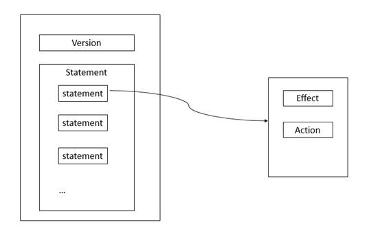
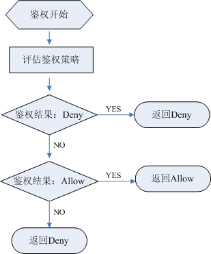

# 策略语言说明<a name="ZH-CN_TOPIC_0111879534"></a>

## 策略结构<a name="section106463610252"></a>

细粒度授权策略结构包括策略版本号（Version）及策略授权语句（Statement）列表。

-   策略版本号：Version，标识策略结构的版本号。
    -   1.0：非细粒度权限。
    -   1.1：细粒度权限。

-   策略授权语句：Statement，包括了基本元素：作用（Effect）和权限集（Action）。

**图 1**  策略结构模型<a name="fig6048544615311"></a>  


## 策略基本元素<a name="section24920662173152"></a>

策略授权语句（Statement）描述的是策略的详细信息，包含作用（Effect）和授权项（Action）。

-   作用（Effect）

    作用包含两种：允许（Allow）和拒绝（Deny），当策略中既有Allow又有Deny的授权语句时，遵循Deny优先的原则。

-   授权项（Action）

    对资源的具体操作权限，支持单个或多个操作权限。

    格式为：服务名:资源类型:操作，例如：vpc:ports:create。

    > **说明：**   
    >-   服务名：产品名称，例如ecs、evs和vpc等，服务名仅支持小写。  
    >-   资源类型和操作没有大小写要求，支持通配符号\*，用户不需要罗列全部授权项，通过配置通配符号\*可以方便快捷地实现授权。  
    >-   策略仅支持API接口级别的权限，用户需要在Action中写入各服务API授权项列表中“授权项”中的内容，来调用表格中左侧的“API接口”来实现细粒度授权。  
    >    各服务支持的策略API授权列表，详情请参见：[权限策略](https://support.huaweicloud.com/usermanual-permissions/zh-cn_topic_0063498930.html)  


## 策略样例<a name="section44276331103751"></a>

-   支持单个操作权限，例如：查询弹性云服务器详情权限

    ```
    {
          "Version": "1.1",
          "Statement": [
                {
                      "Effect": "Allow",
                      "Action": [
                            "ecs:servers:list",
                            "ecs:servers:get",
                            "ecs:serverVolumes:use",
                            "ecs:diskConfigs:use",
                            "ecs:securityGroups:use",
                            "ecs:serverKeypairs:get",
                            "vpc:securityGroups:list",
                            "vpc:securityGroups:get",
                            "vpc:securityGroupRules:get",
                            "vpc:networks:get",
                            "vpc:subnets:get",
                            "vpc:ports:get",
                            "vpc:routers:get"
                      ]
                }
          ]
    }
    ```

-   支持多个操作权限，例如：锁定云服务器和创建云硬盘权限。

    ```
    {
        "Version": "1.1",
          "Statement": [
                {
                      "Effect": "Allow",
                      "Action": [
                            "ecs:servers:lock",
                            "evs:volumes:create"
                      ]
                }
          ]
    }
    ```

-   通配符号\*用法示例：对ECS服务资源的Tenant Guest权限。

    > **说明：**   
    >ECS服务的Tenant Guest权限需要依赖EVS、VPC、IMS服务的Tenant Guest权限。  
    >```  
    >{  
    >    "Version": "1.1",  
    >    "Statement": [  
    >        {  
    >            "Effect": "Allow",  
    >            "Action": [  
    >                "ecs:*:get",  
    >                "ecs:*:list",  
    >                "ecs:serverGroups:manage",  
    >                "evs:*:get",  
    >                "evs:*:list",  
    >                "vpc:*:get",  
    >                "vpc:*:list",  
    >                "ims:*:get",  
    >                "ims:*:list"  
    >            ]  
    >        }  
    >    ]  
    >}  
    >```  


## 策略语法<a name="section1479310270352"></a>

策略结构体不完整时，将不能通过系统的语法校验。

```
Policy = {
<version_block>,
<statement_block>
}

<version_block> = "Version" : "1.1"

<statement_block> = "Statement": [<statement>,<statement>, …]

<statement> = {
<effect_block>,
<action_block>
}

<effect_block> = "Effect" : ("Allow" | "Deny")

<action_block> = "Action": ("*" | [<action_string>, <action_string>,…])
```

-   策略中\[ \]字符为允许多值的意思，当一个元素允许多值时，使用逗号和省略号来表达，比如\[<statement\>,<statement\>, …\]，\[<action\_string\>, <action\_string\>,…\]。
-   多值之间如果用竖线 （**|**）隔开，表示取值只能选取这些值中的一个。比如：\("Allow" | "Deny"\)。
-   当元素取值为数字时，与字符串类似，需要用双引号括起来。比如： <version\_block\> = "Version" : "1.1"。
-   当元素取值为字符串（String）时，支持（**\***）模糊匹配来代表 0 个或多个任意的英文字母。

您还可以通过以下网站了解更多有关JSON的语法标准：

[https://tools.ietf.org/html/rfc7159?spm=a2c4g.11186623.2.12.M8YmXV](https://tools.ietf.org/html/rfc7159?spm=a2c4g.11186623.2.12.M8YmXV)

## 检查规则<a name="section565017773111"></a>

用户被授予的访问策略中可以包含多个授权语句，当策略中既有Allow又有Deny的授权语句时，遵循Deny优先的原则。

用户访问资源时，权限检查逻辑如下：

**图 2**  权限检查逻辑图<a name="fig11089053175940"></a>  


> **说明：**   
>每条策略做评估时， Action之间是或\(or\)的关系。  

1.  用户发起操作请求，鉴权开始。
2.  在用户被授予的访问策略中，系统将优先寻找显式拒绝指令。如找到一个适用的显式拒绝，系统将返回Deny决定，鉴权结束。
3.  如果没有找到显式拒绝指令，系统将寻找适用于请求的任何Allow 指令。
    -   如找到一个显式允许指令，系统将返回Allow决定，由服务继续处理该请求。
    -   如果找不到显式允许，最终决定为Deny。

4.  如果代码在评估过程中的任意点遇到错误，它将生成异常并关闭。

