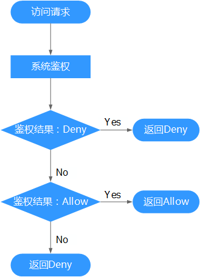

# 策略鉴权规则

用户在发起访问请求时，系统根据用户被授予的访问策略中的action进行鉴权判断。鉴权规则如下：

**图 1**  系统鉴权逻辑图  

  

1.  用户发起访问请求。
2.  系统在用户被授予的策略中寻找请求对应的action，优先寻找Deny指令。如果找到一个适用的Deny指令，系统将返回Deny决定。
3.  如果没有找到Deny指令，系统将寻找适用于请求的任何Allow指令。如果找到一个Allow指令，系统将返回Allow决定。
4.  如果找不到Allow指令，最终决定为Deny，鉴权结束。

