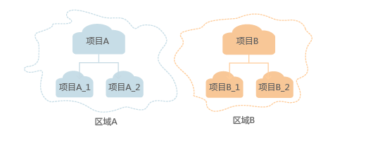

# 管理用户及其权限

您可以通过为用户组授权并将用户加入到用户组的方式，使用户具有用户组中的权限，用户可以根据权限访问系统。

云联盟用户需要在伙伴云创建与归属云同名的用户组，详情请参考：[使用伙伴云](使用伙伴云.md)。

1.  安全管理员在区域下创建项目，使得各项目之间相互隔离。

    **图 1**  项目隔离模型  
    

2.  安全管理员按照用户职责规划用户组并为用户组授权。

    **图 2**  用户组授权模型  
    

3.  安全管理员创建用户并根据用户职责将用户加入到对应的用户组中。

    **图 3**  用户授权模型  
    

4.  用户根据权限访问系统。

