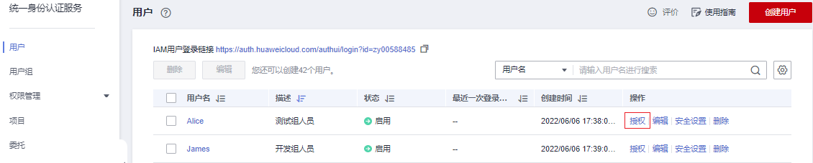
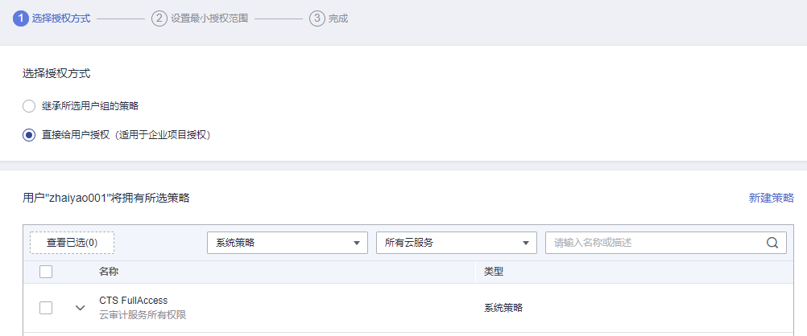

# 给IAM用户授权

如果管理员在[创建IAM用户](创建IAM用户.md)时，没有将其加入任何用户组，**新创建的IAM用户没有任何权限**，管理员可以在IAM控制台为其授予权限。授权后，用户即可根据权限使用帐号中的云服务资源。

## 操作步骤

1.  管理员在用户列表中，单击新建的用户，右侧的“授权“。

    **图 1**  IAM用户授权  
    

2.  在授权页面，选择授权方式和权限。

    -   **继承所选用户组的策略**：将IAM用户加入用户组，用户将拥有所选用户组的所有权限。

        选择“继承所选用户组的策略”，请勾选用户需要加入的用户组。

        **图 2**  暂未开通企业项目  
        

    -   **直接给用户授权（适用于企业项目授权）**：直接给IAM用户授予云服务权限。该授权方式仅在您开通企业项目后支持，如需开通请参考：[开通企业项目](https://support.huaweicloud.com/usermanual-em/pm_topic_0002.html)。

        选择“直接给用户授权”，请勾选需要授予用户的权限，并单击页面右下角“下一步”，进入“选择授权范围”页面，参考[3](#li15680143314351)继续完成操作。

        **图 3**  已开通企业项目  
        

    > **说明：** 
    >-   如果将IAM用户加入默认用户组“admin”，则IAM用户为管理员，可以对所有云服务执行任意操作。
    >-   当某个用户加入多个用户组时，此用户同时拥多个用户组的权限，即取多个用户组权限的全集。
    >-   **所有使用IAM授权的云服务的系统策略，请参见：[系统权限](https://support.huaweicloud.com/usermanual-permissions/iam_01_0001.html)。**
    >-   如果您开通了企业管理，将不能创建IAM项目，请谨慎操作。

3.  （如授权方式选择“继承所选用户组的策略”，无需执行此步骤）在“设置最小授权范围”页面，选择授权IAM用户使用的企业项目。
4.  单击“确定”，完成IAM用户授权。

    授权完成后，管理员可以在“权限管理\>授权管理”页面查看、修改该IAM用户的权限。

