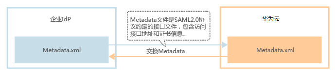

# 联邦身份认证的基本流程和配置步骤

本章为您介绍企业IdP与华为云进行联邦身份认证的内部实现流程和配置步骤，以及常用的企业IdP与华为云对接示例。

## 注意事项

-   企业IdP服务器的时间需要和华为云的时间、时区一致，即都使用GMT时间（Greenwich Mean Time），否则会导致联邦身份认证失败。
-   华为云IAM支持基于SAML 2.0的联邦身份认证，请确保您使用的IdP支持SAML 2.0。
-   由于联邦用户的身份信息（如邮箱、手机号码）保存在企业IdP中，是企业IdP系统映射到华为云的虚拟用户，因此，联邦用户通过身份提供商功能访问华为云时有以下约束：
    -   如果华为云账号开启了[敏感操作](https://support.huaweicloud.com/usermanual-iam/zh-cn_topic_0079477316.html)保护（登录保护或操作保护），对联邦用户不生效，即联邦用户在执行敏感操作时，不需要二次验证。
    -   不支持创建永久访问密钥（AK/SK），支持通过用户或委托token来获取临时访问凭证（临时AK/SK和securitytoken），具体方法请参见：[取临时AK/SK和securitytoken](https://support.huaweicloud.com/api-iam/zh-cn_topic_0097949518.html)。

        如需使用永久AK/SK，只能由账号或是实体IAM用户创建密钥，共享给联邦用户。由于密钥表示用户所拥有的权限，因此建议由与联邦用户同在一个用户组的实体IAM用户创建并分享密钥。

## 联邦身份认证的配置步骤

建立企业IdP与华为云的联邦身份认证关系，需要完成以下配置步骤。

1.  [建立互信关系并创建身份提供商](步骤1-创建身份提供商.md)：交换华为云与企业IdP的元数据文件，建立信任关系，如[图1](#zh-cn_topic_0175818705_fig2351151775810)所示，并在华为云上创建身份提供商。

    **图 1**  交换Metadata文件模型  
    

2.  [在华为云配置身份转换规则](步骤2-配置身份转换规则.md)：通过配置身份转换规则，将IdP中的用户、用户组及其访问权限映射到华为云，用户转换模型如[图2](#zh-cn_topic_0175818705_fig43579668151728)所示。

    **图 2**  用户转换模型  
    

3.  [配置企业管理系统登录入口](步骤3-配置企业管理系统登录入口.md)：将华为云的访问入口配置到企业管理系统中，用户可通过登录企业系统直接访问华为云，如[图3](#zh-cn_topic_0175818705_fig54574848151714)所示。

    **图 3**  配置单点登录模型  
    

## 企业IdP与华为云联邦身份认证交互流程

[图4](#zh-cn_topic_0175818705_fig9855184174610)为用户在发起单点登录请求后，企业IdP与华为云间的交互流程。

**图 4**  联邦身份认证交互流程  

从[图4](#zh-cn_topic_0175818705_fig9855184174610)中可知，联邦身份认证的步骤为：

1.  用户在浏览器中打开从华为云IAM上获取到的登录链接，浏览器向华为云发起单点登录请求。
2.  华为云根据登录链接中携带的信息，查找IAM身份提供商中对应的Metadata文件，构建SAML Request，发送给浏览器。
3.  浏览器收到请求后，转发SAML Request给企业IdP。
4.  用户在企业IdP推送的登录页面中输入用户名和密码，企业IdP对用户提供的身份信息进行验证，并构建携带用户信息的SAML断言，向浏览器发送SAML Response。
5.  浏览器响应后转发SAML Response给华为云。
6.  华为云从SAML Response中取出断言，并根据已配置的身份转换规则映射到具体的IAM用户组，颁发Token。
7.  用户完成单点登录，访问华为云。

## 联邦身份认证配置示例

由于不同的企业IdP系统的配置存在较大差异，本章中对于企业IdP的配置不做详述，具体操作请参考IdP提供商的帮助文档。常见IdP与华为云建立联邦身份认证的操作，请参见：

-   [使用Active Directory Federation Services建立与华为云的联邦身份认证](https://bbs.huaweicloud.com/blogs/765004f286a711e9b759fa163e330718)
-   [使用Shibboleth IdP建立与华为云的联邦身份认证](https://bbs.huaweicloud.com/blogs/d26bfc988d7c11e9b759fa163e330718)
-   [使用Azure AD建立与华为云的联邦身份认证](https://bbs.huaweicloud.com/blogs/140899)

