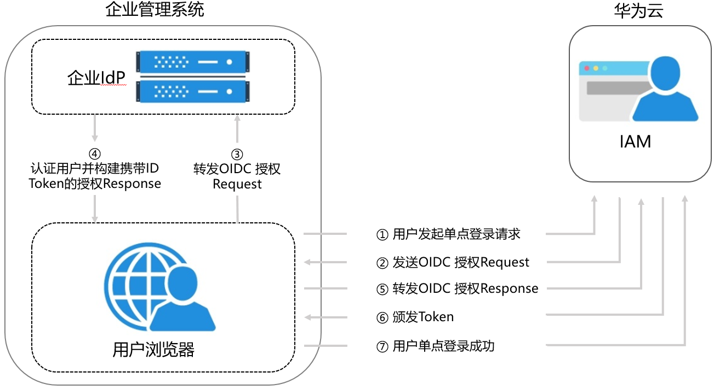

# 联邦身份认证配置概述

本章为您介绍基于OIDC协议的企业IdP与华为云进行联邦身份认证的内部实现流程和配置步骤。

## 联邦身份认证的配置步骤

建立企业管理系统与华为云的联邦身份认证关系，需要完成以下配置步骤。

1.  [创建身份提供商并创建互信关系](步骤1-创建身份提供商-1.md)：在企业IdP中创建OAuth 2.0凭据，在华为云上创建身份提供商并配置授权信息，从而建立企业管理系统和华为云的信任关系。
2.  [配置身份转换规则](步骤2-配置身份转换规则-2.md)：通过在华为云配置身份转换规则，将IdP中的用户、用户组及其访问权限映射到华为云。
3.  [配置企业管理系统登录入口](（可选）步骤3-配置企业管理系统登录入口-3.md)：将华为云的访问入口配置到企业管理系统中，用户可通过登录企业管理系统直接访问华为云。

## 企业管理系统与华为云联邦身份认证交互流程

[图1](#fig19117165554910)为用户在发起单点登录请求后，企业管理系统与华为云间的交互流程。

**图 1**  联邦身份认证交互流程  

从上图中可知，联邦身份认证的步骤为：

1.  用户在浏览器中打开从IAM上获取到的登录链接，浏览器向华为云发起单点登录请求。
2.  华为云根据登录链接中携带的信息，查找IAM身份提供商中对应的配置信息，构建OIDC 授权Request，发送给浏览器。
3.  浏览器收到请求后，转发OIDC授权Request给企业IdP。
4.  用户在企业IdP推送的登录页面中输入用户名和密码，企业IdP对用户提供的身份信息进行验证，并构建携带用户信息的ID Token，向浏览器发送OIDC授权Response。
5.  浏览器响应后转发OIDC授权Response给华为云。
6.  华为云从OIDC授权Response中取出ID Token，并根据已配置的身份转换规则映射到具体的IAM用户组，颁发Token。
7.  用户完成单点登录，访问华为云。

