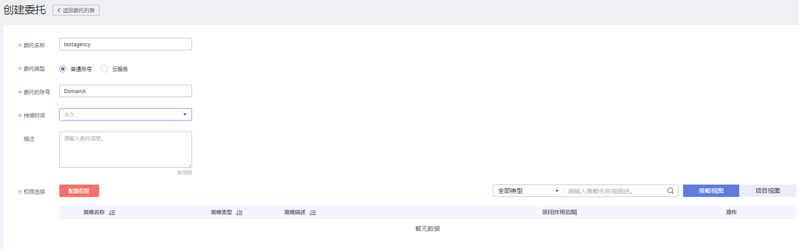

# 自定义身份代理

当企业本地身份认证系统不支持SAML协议，您可以使用自定义身份代理，通过编写代码获得华为云登录链接，使企业用户通过本地的身份认证系统验证身份后，即可登录华为云。

> **说明：**   
>自定义身份代理适用于不支持SAML的企业本地身份认证系统，如果您使用了支持SAML的IdP（身份提供商），推荐您通过配置[联邦身份认证](联邦身份认证的基本流程和配置步骤.md)实现用户使用企业IdP账号单点登录华为云。  

## 前提条件

-   企业已有本地身份认证系统。
-   企业管理员在华为云上注册了可用的账号（账号名以DomainA为例），并已在IAM中创建用户组（用户组名以GroupC为例）并授予Security Administrator和Agent Operator权限，具体方法请参见：[创建用户组并授权](创建用户组并授权.md)。

## 操作步骤

1.  在DomainA中创建IAM用户（用户名以UserB为例），并加入GroupC用户组中，具体方法请参见：[用户组添加用户](用户组添加用户.md)。
2.  将UserB的[访问密钥](https://support.huaweicloud.com/usermanual-ca/ca_01_0003.html)或用户名和密码（推荐使用访问密钥）配置到企业管理系统的配置文件中，以便获取用户认证token和调用API。为了保障您的账号安全，密码和访问密钥建议加密存储。
3.  在IAM控制台左侧导航栏选择“委托”，单击“ 创建委托“。
4.  在创建委托页面，设置委托参数。

    “委托名称“以“testagency“为例，“委托类型“必须选择“普通账号“，“委托的账号“填写“DomainA“，“持续时间“根据具体情况选择，最后赋予您需要进行委托的权限，单击“确定”。

    

5.  在企业管理系统创建用户组“testagency“（与[4](#li415614531821)中的委托名称相同），将企业本地用户按需加入本地用户组，授予其自定义代理登录华为云时的权限，具体方法请参见企业管理系统帮助文档。
6.  用户登录企业系统后，访问企业系统的自定义代理，从委托列表中选择所需要使用的委托，具体操作请联系企业系统管理员。

    > **说明：**   
    >自定义代理的委托列表是企业系统创建的用户组名称与华为云创建的委托名称的交集。  

7.  企业系统自定义代理根据委托，携带IAM用户userB的token调用API（POST /v3.0/OS-CREDENTIAL/securitytokens），获取具有临时身份的securityToken，调用方法请参见：[获取临时AK/SK和securitytoken](https://support.huaweicloud.com/api-iam/iam_04_0002.html)。
8.  企业系统自定义代理携带获取到的临时AK/SK和securitytoken调用API（POST /v3.0/OS-AUTH/securitytoken/logintokens）获取登录票据loginToken。登录票据位于Response Header中的X-Subject-LoginToken。获取方式请参见：[获取自定义代理登录票据](https://support.huaweicloud.com/api-iam/iam_14_1101.html)。

    > **说明：**   
    >logintoken是系统颁发给自定义代理用户的登录票据，承载用户的身份、session等信息，有效期为10min。调用FederationProxyUrl登录云服务控制台时，需要使用logintoken进行认证。  

9.  企业系统自定义代理根据规范创建云服务登录地址FederationProxyUrl，作为Location返回给浏览器。FederationProxyUrl如下：

    _https://auth.huaweicloud.com/authui/federation/login?idp\_login\_url=\{enterprise\_system\_loginURL\}&service=\{console\_service\_url\}&logintoken=\{logintoken\}_

    **表 1**  参数说明

    
    <table><thead align="left"><tr id="row95631538111214"><th class="cellrowborder" valign="top" width="30.65%" id="mcps1.2.3.1.1">
参数

    </th>
    <th class="cellrowborder" valign="top" width="69.35%" id="mcps1.2.3.1.2">
说明

    </th>
    </tr>
    </thead>
    <tbody><tr id="row11563103831211"><td class="cellrowborder" valign="top" width="30.65%" headers="mcps1.2.3.1.1 ">
idp_login_url

    </td>
    <td class="cellrowborder" valign="top" width="69.35%" headers="mcps1.2.3.1.2 ">
企业系统登录地址。

    </td>
    </tr>
    <tr id="row15631038151213"><td class="cellrowborder" valign="top" width="30.65%" headers="mcps1.2.3.1.1 ">
service

    </td>
    <td class="cellrowborder" valign="top" width="69.35%" headers="mcps1.2.3.1.2 ">
需要访问的华为云服务地址。

    </td>
    </tr>
    <tr id="row356333851212"><td class="cellrowborder" valign="top" width="30.65%" headers="mcps1.2.3.1.1 ">
logintoken

    </td>
    <td class="cellrowborder" valign="top" width="69.35%" headers="mcps1.2.3.1.2 ">
自定义代理登录票据。

    </td>
    </tr>
    </tbody>
    </table>

    示例：

    _https://auth.huaweicloud.com/authui/federation/login?idp\_login\_url=https%3A%2F%2Fexample.com&service=https%3a%2f%2fconsole.huaweicloud.com%2fapm%2f%3fregion%3dcn-north-4%23%2fapm%2fatps%2ftopology&logintoken=\*\*\*\*\*\*_

    > **说明：**   
    >该FederationProxyUrl包含从IAM获得的登录票据，票据用于对访问的用户进行身份验证。FederationProxyUrl需要经过UrlEncode编码。  

10. 华为云认证登录票据loginToken成功后，浏览器自动重定向到需要访问的华为云服务控制台，企业用户成功访问华为云控制台。

    loginToken认证失败，返回企业管理系统。

  

