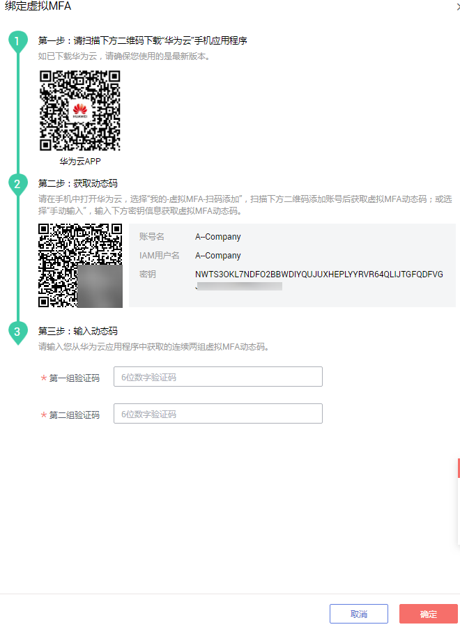
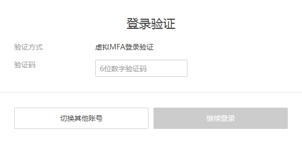
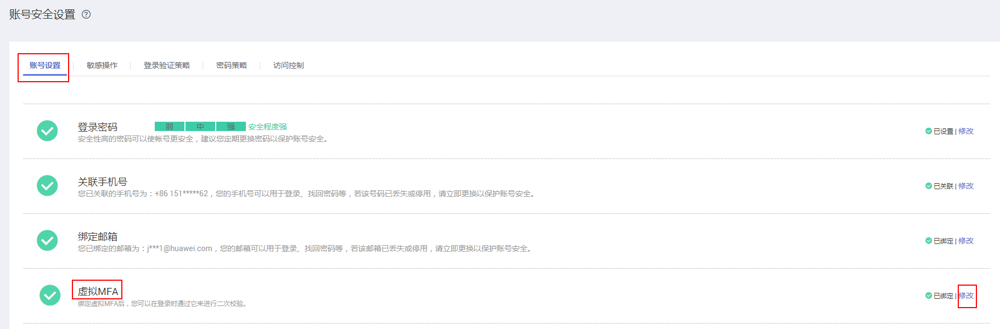
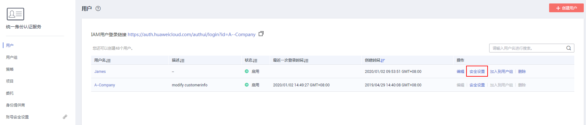
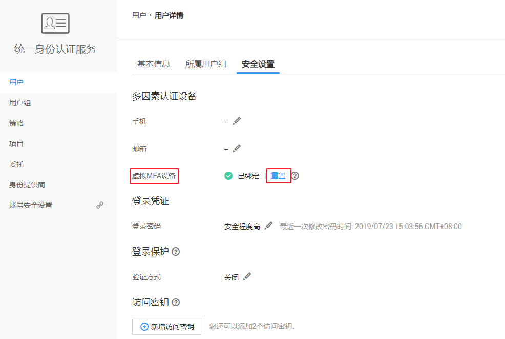

# 虚拟MFA

本章主要为您介绍[如何绑定虚拟MFA](#section135438283333)、[如何解绑虚拟MFA](#section16664103718547)，以及IAM用户手机丢失或删除虚拟MFA应用程序时[管理员如何重置虚拟MFA](#section1136016401592)。

## 什么是虚拟MFA

虚拟Multi-Factor Authentication \(MFA\) 是能产生6位数字认证码的设备，遵循基于时间的一次性密码 （TOTP）标准。MFA设备可以基于硬件也可以基于软件，华为云目前仅支持基于软件的虚拟MFA，虚拟MFA应用程序可以在移动硬件设备（包括智能手机）上运行，非常方便，虚拟MFA是多因素认证方式中的一种。

## 如何绑定虚拟MFA

您需要在智能设备上安装一个虚拟MFA应用程序后（例如：华为云App、Google Authenticator或Microsoft Authenticator），才能绑定虚拟MFA设备。

1.  登录华为云，在右上角单击“控制台”。

    

2.  在“控制台“页面，鼠标移动至右上方的用户名，在下拉列表中选择“安全设置“。

    

3.  在“账号设置”页签中，单击“虚拟MFA”右侧的“立即绑定”。

    

4.  根据右侧弹出的绑定虚拟MFA页面，在您的MFA应用程序中添加用户。

    

    -   扫描二维码

        打开手机上已安装好的MFA应用程序，点击应用程序上右下角的“+”，选择“扫描条形码“，扫描“登录验证策略“页面上的二维码。扫描成功后，华为云会自动添加用户，应用程序上会显示您的账号和密钥。

    -   手动输入

        打开手机上已安装好的MFA应用程序，点击应用程序上右下角的“+”，选择“输入提供的密钥“  ，手动添加用户。

        > **说明：**   
        >手动输入添加用户方式只支持基于时间模式，建议在移动设备中开启自动设置时间功能。  

5.  添加用户完成，返回MFA应用程序首页，查看虚拟MFA的动态口令页面。动态口令每30秒自动更新一次。
6.  在“绑定虚拟MFA”页面输入连续的两组口令，然后单击“确认绑定“，完成绑定虚拟MFA设备的操作。

  

## 如何获取虚拟MFA验证码

绑定虚拟MFA并开启登录保护或操作保护后，用户在进行登录或进行敏感操作时，需要输入MFA应用程序的动态验证码，下图以登录验证为例。

此时，您需要打开智能设备上的虚拟MFA应用程序，查看并输入用户已绑定账号的验证码，下图以华为云App为例。

## 如何解绑虚拟MFA

解绑虚拟MFA适用于手机不丢失或者没有删除虚拟MFA应用程序的用户，用户可以在界面自助完成解绑虚拟MFA的操作。如果用户的手机丢失或已删除虚拟MFA应用程序，请联系管理员[重置虚拟MFA](#section1136016401592)。

1.  登录华为云，在右上角单击“控制台”。

    

2.  在“控制台“页面，鼠标移动至右上方的用户名，在下拉列表中选择“安全设置“。

    

3.  在“账号安全设置\>账号设置”页面，单击“虚拟MFA”右侧的“修改”。

    

4.  在页面中，在页面中输入从虚拟MFA设备获取的动态验证码。
5.  单击“确定”，验证成功后，完成解绑MFA操作。

## 管理员重置虚拟MFA

手机丢失或已删除虚拟MFA应用程序的**华为云账号**，请联系客服为您重置虚拟MFA。

手机丢失或已删除虚拟MFA应用程序的**IAM用户**，请联系[管理员](https://support.huaweicloud.com/usermanual-iam/zh-cn_topic_0079496985.html)重置虚拟MFA，管理员的操作步骤如下所示。

1.  登录华为云，在右上角单击“控制台”。

    

2.  在控制台页面，鼠标移动至右上方的用户名，在下拉列表中选择“统一身份认证”。

    

3.  在“统一身份认证服务\>用户”页签中的用户列表中，单击用户右侧的“安全设置”。

    

4.  在“安全设置”页面中，单击“虚拟MFA设备”右侧的“重置”。

    

5.  单击“确定”，重置成功。

