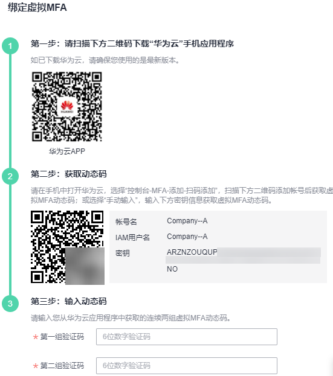
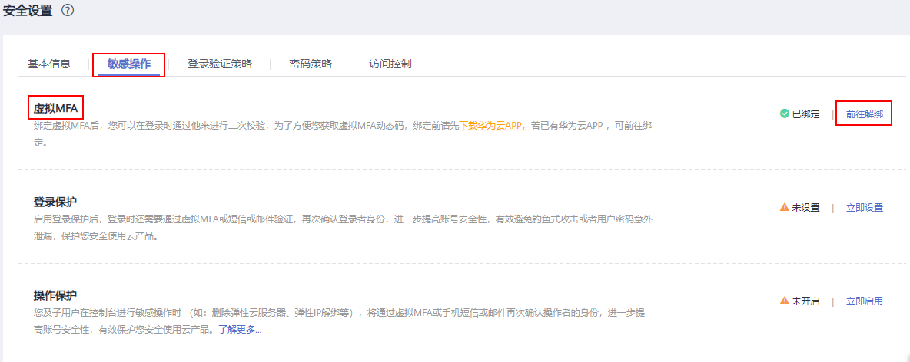

# 虚拟MFA

本章主要为您介绍[如何绑定虚拟MFA](#section135438283333)、[如何解绑虚拟MFA](#section16664103718547)，以及IAM用户手机丢失或删除虚拟MFA应用程序时[管理员如何重置虚拟MFA](#section1136016401592)。

## 什么是虚拟MFA

虚拟Multi-Factor Authentication \(MFA\) 是能产生6位数字认证码的设备，遵循基于时间的一次性密码 （TOTP）标准。MFA设备可以基于硬件也可以基于软件，目前仅支持基于软件的虚拟MFA，即虚拟MFA应用程序，可以在移动硬件设备（包括智能手机）上运行，非常方便，虚拟MFA是多因素认证方式中的一种。

## 如何绑定虚拟MFA

您需要在智能设备上安装一个虚拟MFA应用程序后（例如：华为云App、Google Authenticator或Microsoft Authenticator），才能绑定虚拟MFA设备。

1.  [进入安全设置](安全设置概述.md#zh-cn_topic_0179263545_section113256158575)。
2.  在“安全设置\>敏感操作”页面，单击“虚拟MFA”右侧的“前往绑定”。

    **图 1**  虚拟MFA  
    

3.  根据右侧弹出的绑定虚拟MFA页面，在您的MFA应用程序中添加用户。

    **图 2**  绑定虚拟MFA  
    

    您可以通过扫描二维码、手动输入两种方式绑定MFA设备，下面以“华为云”手机应用程序为例绑定虚拟MFA：

    -   扫描二维码

        打开手机上已安装好的“华为云”手机应用程序，选择“控制台-MFA-添加-扫码添加”，扫描“绑定虚拟MFA”弹窗中的二维码。扫描成功后，“华为云”手机应用程序会自动添加用户，虚拟MFA列表中出现帐号/IAM用户名及对应的MFA动态码。

    -   手动输入

        打开手机上已安装好的“华为云”手机应用程序，选择“控制台-MFA-添加-手动输入”。帐号绑定虚拟MFA，输入帐号和密钥；IAM用户绑定虚拟MFA，输入IAM用户名和密钥。单击“添加”手动添加用户。

        > **说明：** 
        >手动输入添加用户方式只支持基于时间模式，建议在移动设备中开启自动设置时间功能。

4.  添加用户完成，在“华为云”手机应用程序“虚拟MFA页面”，查看虚拟MFA的动态口令页面。动态口令每30秒自动更新一次。
5.  在“绑定虚拟MFA”页面输入连续的两组口令，然后单击“确定“，完成绑定虚拟MFA设备的操作。

## 如何获取虚拟MFA验证码

绑定虚拟MFA并开启登录保护或操作保护后，用户在进行登录或进行敏感操作时，需要输入MFA应用程序的动态验证码，下图以登录验证为例。

**图 3**  虚拟MFA登录验证  

此时，您需要打开智能设备上的虚拟MFA应用程序，查看并输入用户已绑定帐号的验证码，下图以华为云App为例。

**图 4**  查看MFA验证码  

## 如何解绑虚拟MFA

解绑虚拟MFA适用于手机未丢失或者没有删除虚拟MFA应用程序的IAM用户或帐号，IAM用户或帐号可以在界面自助完成解绑虚拟MFA的操作。

-   手机丢失或已删除虚拟MFA应用程序的IAM用户，请联系管理员[重置虚拟MFA](#section1136016401592)。
-   手机丢失或已删除虚拟MFA应用程序的华为云帐号，请联系客服为您重置虚拟MFA。

1.  [进入安全设置](安全设置概述.md#zh-cn_topic_0179263545_section113256158575)。
2.  在“安全设置\>敏感操作”页面，单击“虚拟MFA”右侧的“前往解绑”。

    **图 5**  解绑虚拟MFA  
    

3.  在“解绑虚拟MFA”页面中输入从虚拟MFA设备获取的动态验证码。
4.  单击“确定”，验证成功后，完成解绑MFA操作。

## 管理员重置虚拟MFA

手机丢失或已删除虚拟MFA应用程序的**华为云帐号**，请联系客服为您重置虚拟MFA。

手机丢失或已删除虚拟MFA应用程序的**IAM用户**，请联系[管理员](使用前必读.md)重置虚拟MFA，管理员的操作步骤如下所示。

1.  登录统一身份认证服务管理控制台。
2.  在“统一身份认证服务\>用户”页签中的用户列表中，单击用户右侧的“安全设置”。
3.  在“安全设置”页面中，单击“虚拟MFA设备”右侧的“重置”。
4.  单击“确定”，重置成功。

