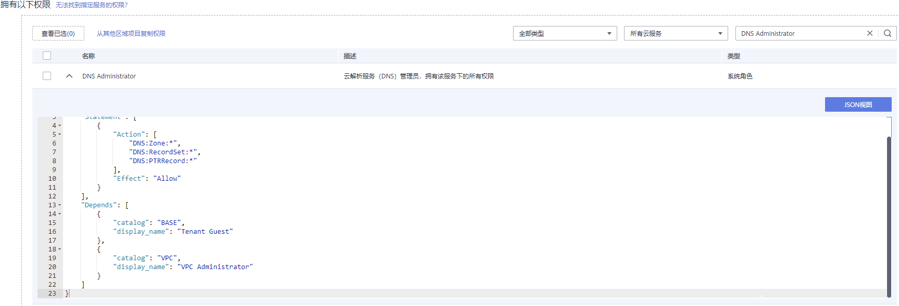

# 角色<a name="iam_01_0601"></a>

角色是IAM最初提供的一种根据用户的工作职能定义权限的粗粒度授权机制。该机制以服务为粒度，提供有限的服务相关角色用于授权。角色并不能满足用户对精细化授权的要求，无法完全达到企业对权限最小化的安全管控要求。

由于华为云各服务之间存在业务依赖关系，因此给用户组授予角色时，需要将依赖的其他角色一并授予该用户组，保证用户权限生效。具体请参见：[依赖角色的授权方法](依赖角色的授权方法.md)。

## 角色内容<a name="zh-cn_topic_0165687178_section9359105292516"></a>

给用户组选择角色时，单击角色前面的，可以查看角色的详细内容，以“DNS Administrator”为例，说明角色的内容。

**图 1**  DNS Administrator角色内容<a name="fig16961114335410"></a>  


```
{
    "Version": "1.0",
    "Statement": [
        {
            "Action": [
                "DNS:Zone:*",
                "DNS:RecordSet:*",
                "DNS:PTRRecord:*"
            ],
            "Effect": "Allow"
        }
    ],
    "Depends": [
        {
            "catalog": "BASE",
            "display_name": "Tenant Guest"
        },
        {
            "catalog": "VPC",
            "display_name": "VPC Administrator"
        }
    ]
}
```

## 参数说明<a name="zh-cn_topic_0165687178_section1057124415300"></a>

**表 1**  参数说明

<a name="table263109993745"></a>
<table><thead align="left"><tr id="row5964380593745"><th class="cellrowborder" colspan="2" valign="top" id="mcps1.2.5.1.1"><p id="p3840680793745"><a name="p3840680793745"></a><a name="p3840680793745"></a>参数</p>
</th>
<th class="cellrowborder" valign="top" id="mcps1.2.5.1.2"><p id="p2394366493745"><a name="p2394366493745"></a><a name="p2394366493745"></a>含义</p>
</th>
<th class="cellrowborder" valign="top" id="mcps1.2.5.1.3"><p id="p6038866693745"><a name="p6038866693745"></a><a name="p6038866693745"></a>值</p>
</th>
</tr>
</thead>
<tbody><tr id="row33603866145041"><td class="cellrowborder" colspan="2" valign="top" headers="mcps1.2.5.1.1 "><p id="p6202570314511"><a name="p6202570314511"></a><a name="p6202570314511"></a>Version</p>
</td>
<td class="cellrowborder" valign="top" headers="mcps1.2.5.1.2 "><p id="iam_01_0601_p5802604114511"><a name="iam_01_0601_p5802604114511"></a><a name="iam_01_0601_p5802604114511"></a>角色的版本</p>
</td>
<td class="cellrowborder" valign="top" headers="mcps1.2.5.1.3 "><p id="p12283164818190"><a name="p12283164818190"></a><a name="p12283164818190"></a>1.0：代表角色。</p>
</td>
</tr>
<tr id="row3390115193745"><td class="cellrowborder" rowspan="2" valign="top" width="15%" headers="mcps1.2.5.1.1 "><p id="p2571453445"><a name="p2571453445"></a><a name="p2571453445"></a>Statement：</p>
<p id="p4120437893745"><a name="p4120437893745"></a><a name="p4120437893745"></a>角色的授权语句</p>
</td>
<td class="cellrowborder" valign="top" width="15%" headers="mcps1.2.5.1.1 "><p id="p15225242142620"><a name="p15225242142620"></a><a name="p15225242142620"></a>Action：授权项</p>
</td>
<td class="cellrowborder" valign="top" width="20%" headers="mcps1.2.5.1.2 "><p id="p22261942112610"><a name="p22261942112610"></a><a name="p22261942112610"></a>操作权限</p>
</td>
<td class="cellrowborder" valign="top" width="50%" headers="mcps1.2.5.1.3 "><p id="p22471177492"><a name="p22471177492"></a><a name="p22471177492"></a>格式为：服务名:资源类型:操作</p>
<p id="p1780485644612"><a name="p1780485644612"></a><a name="p1780485644612"></a>"DNS:Zone:*"：表示对DNS的Zone所有操作。其中“DNS”为服务名；“Zone”为资源类型；“*”为通配符，表示对Zone资源类型可以执行所有操作。</p>
</td>
</tr>
<tr id="row14410123292620"><td class="cellrowborder" valign="top" headers="mcps1.2.5.1.1 "><p id="p154997388265"><a name="p154997388265"></a><a name="p154997388265"></a>Effect：作用</p>
</td>
<td class="cellrowborder" valign="top" headers="mcps1.2.5.1.1 "><p id="p1043912593493"><a name="p1043912593493"></a><a name="p1043912593493"></a>定义Action中的操作权限是否允许执行</p>
</td>
<td class="cellrowborder" valign="top" headers="mcps1.2.5.1.2 "><a name="ul10506203862610"></a><a name="ul10506203862610"></a><ul id="ul10506203862610"><li>Allow：允许执行。</li><li>Deny：不允许执行。</li></ul>
<div class="note" id="note273204052719"><a name="note273204052719"></a><a name="note273204052719"></a><span class="notetitle"> 说明： </span><div class="notebody"><p id="p1074104019279"><a name="p1074104019279"></a><a name="p1074104019279"></a>当同一个Action的Effect既有Allow又有Deny时，遵循Deny优先的原则。</p>
</div></div>
</td>
</tr>
<tr id="row1374963893745"><td class="cellrowborder" rowspan="2" valign="top" width="15%" headers="mcps1.2.5.1.1 "><p id="p3501469920235"><a name="p3501469920235"></a><a name="p3501469920235"></a>Depends：</p>
<p id="p128610994517"><a name="p128610994517"></a><a name="p128610994517"></a>角色的依赖关系</p>
</td>
<td class="cellrowborder" valign="top" width="15%" headers="mcps1.2.5.1.1 "><p id="p2969357393745"><a name="p2969357393745"></a><a name="p2969357393745"></a>catalog</p>
</td>
<td class="cellrowborder" valign="top" width="20%" headers="mcps1.2.5.1.2 "><p id="p7299184515112"><a name="p7299184515112"></a><a name="p7299184515112"></a>依赖的角色所属服务</p>
</td>
<td class="cellrowborder" valign="top" width="50%" headers="mcps1.2.5.1.3 "><p id="p250437493745"><a name="p250437493745"></a><a name="p250437493745"></a>服务名称。例如：BASE、VPC。</p>
</td>
</tr>
<tr id="row1979566093745"><td class="cellrowborder" valign="top" headers="mcps1.2.5.1.1 "><p id="p5663788193745"><a name="p5663788193745"></a><a name="p5663788193745"></a>display_name</p>
</td>
<td class="cellrowborder" valign="top" headers="mcps1.2.5.1.1 "><p id="p0173165825112"><a name="p0173165825112"></a><a name="p0173165825112"></a>依赖的角色名称</p>
</td>
<td class="cellrowborder" valign="top" headers="mcps1.2.5.1.2 "><p id="p1935892693745"><a name="p1935892693745"></a><a name="p1935892693745"></a>角色名称。</p>
<div class="note" id="note1885115616538"><a name="note1885115616538"></a><a name="note1885115616538"></a><span class="notetitle"> 说明： </span><div class="notebody"><p id="p19372161025415"><a name="p19372161025415"></a><a name="p19372161025415"></a>给用户组授予示例的“DNS Administraor”角色时，必须同时勾选该角色依赖的角色“Tenant Guest”和“VPC Administrator”，“DNS Administraor”才会生效。</p>
<p id="p4931192513538"><a name="p4931192513538"></a><a name="p4931192513538"></a>了解更多角色依赖关系，请参考：<a href="https://support.huaweicloud.com/usermanual-permissions/iam_01_0001.html" target="_blank" rel="noopener noreferrer">系统权限</a>。</p>
</div></div>
</td>
</tr>
</tbody>
</table>

