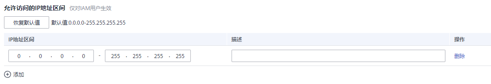

# 访问控制

[进入安全设置](安全设置概述.md#zh-cn_topic_0179263545_section113256158575)后，选择“访问控制”页签，可以对[允许访问的IP地址区间](#zh-cn_topic_0176803440_section1659055844011)、[允许访问的IP地址或网段](#zh-cn_topic_0176803440_section5282253478)、[允许访问的VPC Endpoint](#zh-cn_topic_0176803440_section148601027258)进行修改。

[管理员](使用前必读.md)可以设置访问控制策略，限制用户只能从特定IP地址区间、网段及VPC Endpoint访问华为云。普通IAM用户没有权限查看此页面，如需使用，请联系管理员为您操作或添加权限。

**访问控制生效条件：**

-   控制台访问（推荐）：仅对帐号下的IAM用户和联邦用户登录控制台生效，对帐号本身不生效。
-   API访问：仅对帐号下的IAM用户和联邦用户通过API网关访问API接口生效，修改后2小时生效。

> **说明：** 
>-   访问控制策略最多可设置200条。
>-   如果IAM用户或联邦用户通过代理访问华为云，需按照代理IP设置允许访问的IP地址区间/IP地址或网段；如果IAM用户或联邦用户通过公网访问华为云，请按照公网IP进行设置。

## 允许访问的IP地址区间

**图 1**  允许访问的IP地址区间  

限制用户只能从设定范围内的IP地址访问华为云，可以在0.0.0.0\~255.255.255.255之间设置。默认值为0.0.0.0\~255.255.255.255。如不设置或设置为默认值意味着您的IAM用户可以从任意地方访问华为云。

## 允许访问的IP地址或网段

限制用户只能从设定的IP地址或网段访问华为云，例如：10.10.10.10/32。

## 允许访问的VPC Endpoint

仅在“API访问”页签中可进行配置。限制用户只能从具有设定ID的VPC Endpoint访问华为云API，例如：0ccad098-b8f4-495a-9b10-613e2a5exxxx。若未进行访问控制配置，则默认用户从所有VPC Endpoint都能访问API。

> **说明：** 
>-   “允许访问的IP地址区间”、“允许访问的IP地址区间或网段”和“允许访问的VPC Endpoint”，如果同时设置，只要满足其中一种即可允许访问。
>-   单击“恢复默认值”，可以将“允许访问的IP地址区间”恢复为默认值，即0.0.0.0\~255.255.255.255，同时将“允许访问的IP地址区间或网段”、“允许访问的VPC Endpoint ”清空。

