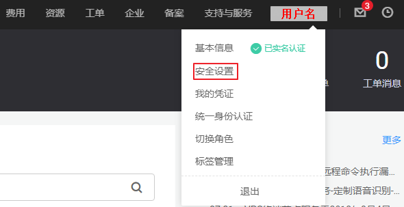
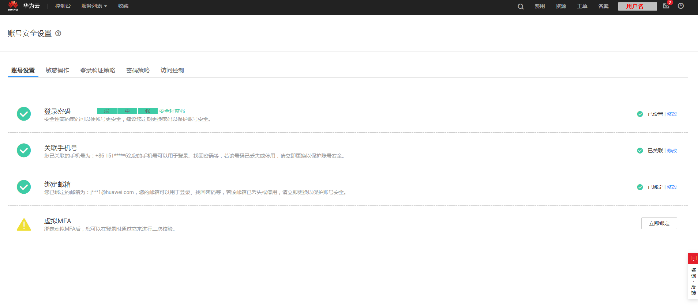

# 账号安全设置概述

当您需要对账号的安全信息进行设置时，可以通过“账号安全设置”进行操作。“账号安全设置”包括“[账号设置](账号设置.md#iam_01_0703)”、“[设置敏感操作](敏感操作.md#zh-cn_topic_0079477316)”、“[设置登录验证策略](登录验证策略.md#iam_01_0704)”、“[密码策略](密码策略.md#iam_01_0607)”、“[设置访问控制策略](访问控制.md#zh-cn_topic_0079477318)”。本章为您介绍“账号安全设置”的使用对象和如何进入“账号安全设置”。

## 账号安全设置的使用对象

[表1 ](#zh-cn_topic_0179263545_table9148216234)为账号安全设置中不同页签下对应的不同使用对象。

**表 1**  账号安全设置的使用对象

<table><thead align="left"><tr id="zh-cn_topic_0179263545_row181582192316"><th class="cellrowborder" valign="top" width="22.86%" id="mcps1.2.3.1.1">
功能

</th>
<th class="cellrowborder" valign="top" width="77.14%" id="mcps1.2.3.1.2">
使用对象

</th>
</tr>
</thead>
<tbody><tr id="zh-cn_topic_0179263545_row815152119236"><td class="cellrowborder" valign="top" width="22.86%" headers="mcps1.2.3.1.1 ">
<a href="账号设置.md#iam_01_0703">账号设置</a>

</td>
<td class="cellrowborder" valign="top" width="77.14%" headers="mcps1.2.3.1.2 ">
<a href="https://support.huaweicloud.com/usermanual-iam/zh-cn_topic_0079496985.html" target="_blank" rel="noopener noreferrer">管理员</a>和普通IAM用户均可修改，联邦用户和云联盟用户不可查看。

</td>
</tr>
<tr id="zh-cn_topic_0179263545_row915192172319"><td class="cellrowborder" valign="top" width="22.86%" headers="mcps1.2.3.1.1 ">
<a href="敏感操作.md#zh-cn_topic_0079477316">敏感操作</a>

</td>
<td class="cellrowborder" valign="top" width="77.14%" headers="mcps1.2.3.1.2 ">
<a href="https://support.huaweicloud.com/usermanual-iam/zh-cn_topic_0079496985.html" target="_blank" rel="noopener noreferrer">管理员</a>可以修改，普通IAM用户不可查看。

</td>
</tr>
<tr id="zh-cn_topic_0179263545_row111614211238"><td class="cellrowborder" valign="top" width="22.86%" headers="mcps1.2.3.1.1 ">
<a href="登录验证策略.md#iam_01_0704">登录验证策略</a>

</td>
<td class="cellrowborder" valign="top" width="77.14%" headers="mcps1.2.3.1.2 ">
<a href="https://support.huaweicloud.com/usermanual-iam/zh-cn_topic_0079496985.html" target="_blank" rel="noopener noreferrer">管理员</a>可以修改，普通IAM用户仅可查看。

</td>
</tr>
<tr id="zh-cn_topic_0179263545_row1716142115230"><td class="cellrowborder" valign="top" width="22.86%" headers="mcps1.2.3.1.1 ">
<a href="密码策略.md#iam_01_0607">密码策略</a>

</td>
<td class="cellrowborder" valign="top" width="77.14%" headers="mcps1.2.3.1.2 ">
<a href="https://support.huaweicloud.com/usermanual-iam/zh-cn_topic_0079496985.html" target="_blank" rel="noopener noreferrer">管理员</a>可以修改，普通IAM用户仅可查看。

</td>
</tr>
<tr id="zh-cn_topic_0179263545_row1416192122311"><td class="cellrowborder" valign="top" width="22.86%" headers="mcps1.2.3.1.1 ">
<a href="访问控制.md#zh-cn_topic_0079477318">访问控制</a>

</td>
<td class="cellrowborder" valign="top" width="77.14%" headers="mcps1.2.3.1.2 ">
<a href="https://support.huaweicloud.com/usermanual-iam/zh-cn_topic_0079496985.html" target="_blank" rel="noopener noreferrer">管理员</a>可以修改，普通IAM用户不可查看。

</td>
</tr>
</tbody>
</table>

## 如何进入账号安全设置

-   所有用户均可通过控制台入口进入“账号安全设置”。
    1.  登录华为云，在右上角单击“控制台”。

        

    2.  在“控制台“页面，鼠标移动至右上方的用户名，在下拉列表中选择“安全设置“。

        

        

-   [管理员](https://support.huaweicloud.com/usermanual-iam/zh-cn_topic_0079496985.html)可通过IAM控制台进入“账号安全设置”。
    1.  登录华为云，在右上角单击“控制台”。

        

    2.  在控制台页面，鼠标移动至右上方的用户名，在下拉列表中选择“统一身份认证”。

        

    3.  进入IAM控制台，在左侧导航栏中，选择“账号安全设置”页签，进入“账号安全设置”。

        

