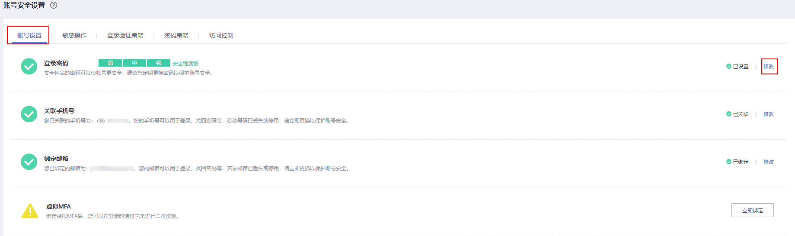
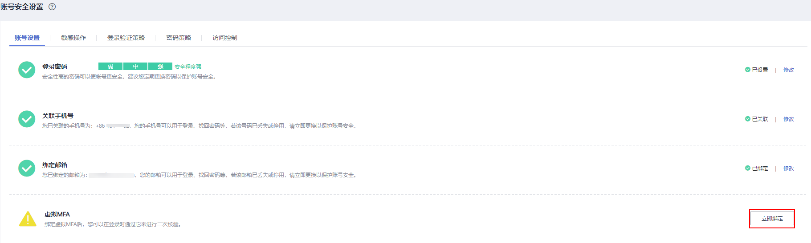

# 账号设置

本页面的所有操作允许账号及IAM用户修改。

> **说明：**   
>-   手机号和邮箱只能绑定一个用户，不可重复绑定。  
>-   一个用户仅能绑定一个手机、邮箱、虚拟MFA设备。  

## 登录密码、关联手机号、绑定邮箱

修改登录密码、关联手机号，绑定邮箱类似，以修改密码为例。

1.  [进入账号安全设置](账号安全设置概述.md#zh-cn_topic_0179263545_section113256158575)。
2.  在“账号安全设置”页面中，选择“账号设置”页签，单击“登录密码”右侧的“修改”，进入“修改密码”页面。

    

3.  选择身份验证方式并输入验证码。

    > **说明：**   
    >您只有同时绑定了邮箱和手机，才能选择验证方式。如果邮箱和手机都未绑定，则无需验证。  

4.  输入原密码、新密码并确认密码。

    > **说明：**   
    >-   密码不能是用户名或者用户名的倒序，例如：用户名为A12345，则密码不能为A12345、a12345、54321A和54321a。  
    >-   密码的强弱程度，例如密码的最小长度等，可以由管理员在密码策略中进行设置。  

5.  单击“确定”，完成密码修改。

> **说明：**   
>一个账号仅能绑定一个手机、邮箱、虚拟MFA，即为敏感操作进行二次验证的设备。  

## 虚拟MFA

虚拟Multi-Factor Authentication \(MFA\) 是能产生6位数字认证码的设备，遵循基于时间的一次性密码 （TOTP）标准。MFA设备可以基于硬件也可以基于软件，华为云目前仅支持基于软件的虚拟MFA，虚拟MFA应用程序可以在移动硬件设备（包括智能手机）上运行，非常方便，虚拟MFA是多因素认证方式中的一种。

本章为您介绍如何绑定虚拟MFA，如需了解有关解绑虚拟MFA、重置虚拟MFA的操作，请参见：[虚拟MFA](https://support.huaweicloud.com/usermanual-iam/iam_01_0031.html)。

> **说明：**   
>您需要先在智能设备上安装一个MFA应用程序（例如： “华为云”手机应用程序），才能绑定虚拟MFA设备。  

1.  [进入账号安全设置](账号安全设置概述.md#zh-cn_topic_0179263545_section113256158575)。
2.  在“账号安全设置\>账号设置”页面，单击“虚拟MFA”右侧的“立即绑定”。

    

3.  根据右侧弹出的绑定虚拟MFA页面，在您的MFA应用程序中添加用户。

    **图 1**  绑定虚拟MFA  
    

    -   扫描二维码

        打开手机上已安装好的MFA应用程序，点击应用程序上右下角的“+”，选择“扫描条形码“，扫描“登录验证策略“页面上的二维码。扫描成功后，华为云会自动添加用户，应用程序上会显示您的账号和密钥。

    -   手动输入

        打开手机上已安装好的MFA应用程序，点击应用程序上右下角的“+”，选择“输入提供的密钥“  ，手动添加用户。

        > **说明：**   
        >手动输入添加用户方式只支持基于时间模式，建议在移动设备中开启自动设置时间功能。  

4.  添加用户完成，返回MFA应用程序首页，查看虚拟MFA的动态口令页面。动态口令每30秒自动更新一次。
5.  在“绑定虚拟MFA”页面输入连续的两组口令，然后单击“确认绑定“，完成绑定虚拟MFA设备的操作。

