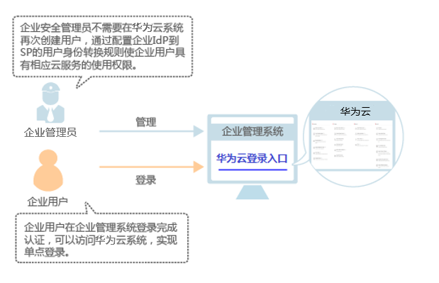

# 身份提供商概述

IAM支持基于SAML、OIDC协议的单点登录，如果您已经有自己的企业管理系统，同时您的用户需要使用您帐号内的云服务资源，您可以使用IAM的身份提供商功能，实现用户使用企业管理系统帐号单点登录华为云，这一过程称之为联邦身份认证。

目前IAM支持两种形式的联邦身份认证：

-   浏览器页面单点登录（Web SSO）：浏览器作为通讯媒介，适用于普通用户通过浏览器访问华为云。您可以通过以下两种方式实现单点登录：
    -   [配置企业管理系统登录入口](（可选）步骤3-配置企业管理系统登录入口.md)后，通过企业管理系统单点登录华为云。
    -   通过华为云提供的[企业联邦用户登录](登录华为云.md#section1578531670)入口，输入企业管理系统帐号、密码，登录华为云。

-   调用API接口：开发工具/应用程序作为通讯媒介，例如OpenStack Client、ShibbolethECP Client，适用于企业或用户通过API调用方式访问华为云。

本章为您介绍通过浏览器页面单点登录华为云的过程（Web SSO），如需了解通过API调用方式访问华为云，请参见：[联邦身份认证管理](https://support.huaweicloud.com/api-iam/iam_02_0001.html)。

## 基本概念

-   身份提供商（Identity Provider，简称IdP）

    负责收集、存储用户身份信息，如用户名、密码等，在用户登录时负责认证用户的服务。在企业与华为云联邦身份认证的过程中，身份提供商指企业自身的身份提供商，目前常用的第三方IdP有Microsoft Active Directory（AD FS）、Shibboleth。

-   服务提供商（Service Provider，简称SP）

    服务提供商通过与身份提供商IdP建立信任关系，使用IdP提供的用户信息，为用户提供具体的服务。在企业与华为云联邦身份认证的过程中，服务提供商指华为云。

-   联邦身份认证

    身份提供商IdP与服务提供商SP[建立信任关系并完成交互流程](联邦身份认证配置概述.md#zh-cn_topic_0175818705_section7468191134310)，实现用户单点登录的过程，称之为联邦身份认证。

-   单点登录（Single Sign-On，简称SSO）

    用户在身份提供商IdP系统登录后，就可以通过跳转链接访问已建立互信关系的服务提供商SP系统，这一过程称之为单点登录。如：企业管理系统与华为云建立互信关系后，企业管理系统中的用户通过华为云提供的登录入口，使用已有的帐号密码在企业管理系统中登录后，即可跳转访问华为云。

-   SAML 2.0

    安全断言标记语言（Secturity Assertion Markup Language 2.0，缩写为SAML 2.0）是一个由一组协议组成，用来传输安全声明的XML框架。SAML2.0是由标准化组织OASIS提出的用于安全操作的标准，是很多身份提供商 （IdP）使用的一种开放标准，关于SAML2.0的详细描述请参见：[SAML 2.0技术概述](https://docs.oasis-open.org/security/saml/Post2.0/sstc-saml-tech-overview-2.0.html)。IAM支持使用SAML2.0协议进行联邦身份认证，因此与华为云建立联邦身份认证的企业IdP必须支持SAML2.0协议。

-   OIDC

    OIDC是OpenID Connect的简称，是一个基于OAuth 2.0协议的身份认证标准协议。IAM支持使用OIDC1.0协议进行联邦身份认证，因此与华为云建立联邦身份认证的企业IdP必须支持OIDC 1.0协议。关于OIDC的详细描述请参见：[欢迎使用OpenID Connect](https://openid.net/connect/)。

-   OAuth 2.0

    OAuth 2.0是Open Authorization 2.0的简称，是一种开放授权协议，授权框架支持第三方应用程序以自己的名义获取访问权限。

## 使用联邦身份认证的优势

-   管理用户简单

    使用联邦身份认证前，管理员需要在企业管理系统和华为云中分别为用户创建帐号。

    使用联邦身份认证后，企业管理员只需要在企业管理系统中为用户创建帐号，用户即可同时访问两个系统，降低了人员管理成本。

-   用户操作方便

    使用联邦身份认证前，用户访问企业管理系统和华为云时需要使用两个系统的帐号登录。

    使用联邦身份认证后，用户在本企业管理系统中登录即可访问两个系统。

    **图 1**  使用联邦身份认证的优势  
    

## 注意事项

-   企业IdP服务器的时间需要和华为云的时间、时区一致，即都使用GMT时间（Greenwich Mean Time），否则会导致联邦身份认证失败。
-   由于联邦用户的身份信息（如邮件地址、手机号码）保存在企业IdP中，是企业IdP映射到华为云的虚拟用户，因此，联邦用户通过身份提供商功能访问华为云时有以下约束：
    -   如果帐号开启了[敏感操作](敏感操作.md)保护（登录保护或操作保护），对联邦用户不生效，即联邦用户在执行敏感操作时，不需要二次验证。
    -   不支持创建永久访问密钥（AK/SK），支持通过用户或委托token来获取临时访问凭证（临时AK/SK和securitytoken），具体方法请参见：[获取临时AK/SK和securitytoken](https://support.huaweicloud.com/api-iam/iam_04_0002.html)。

        如需使用永久AK/SK，只能由帐号或是实体IAM用户创建密钥，共享给联邦用户。由于密钥表示用户所拥有的权限，因此建议由与联邦用户同在一个用户组的实体IAM用户创建并分享密钥。

