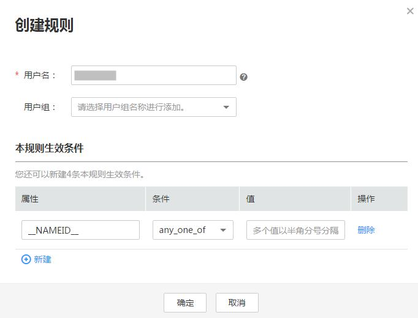

# 通过规则控制联邦用户访问权限

联邦用户的身份及权限信息由企业管理员通过企业IdP维护，通过规则可以将联邦用户的身份及权限信息映射到本系统中，通过规则可以控制联邦用户可以执行哪些操作、访问哪些资源等。

## 前提条件

-   已创建身份提供商，并验证身份提供商的登录链接可以正常使用。
-   了解SAML2.0协议，熟悉元数据文件。
-   了解SAML2.0认证成功后的Assertion结构。

## 操作步骤

1.  在系统首页，单击“控制台“。
2.  单击右上方登录的用户，在下拉列表中选择“统一身份认证“。
3.  在左侧导航窗格中，单击“身份提供商“。
4.  在身份提供商列表中，选择您创建的身份提供商，单击“修改“。

    进入“修改身份提供商“界面。

5.  在“身份转换规则“区域单击“创建规则“。

    > **说明：**   
    >当您创建完身份提供商后，系统会预置一条默认的规则，该规则将联邦用户的用户名统一转换为“FederationUser“，用于在本系统中显示用户名称。仅允许当前IdP的联邦用户访问部分资源。若此条规则不符合您的使用要求，您可在“编辑规则“中将其修改。  

    **图 1**  创建规则示例  
    

    -   用户名：表示联邦用户在本系统中显示的用户名。为了便于区分本系统的用户与联邦用户，建议联邦用户使用“FederationUser\_“开头。用户名可以自定义具体名称，也可以是一个简单的表达式，如：FederationUser\_\{email\}。规则创建成功后，\{email\}自动替换为联邦用户的邮箱。即系统中显示的用户名为：FederationUser\_XXX@XXX（XXX@XXX为用户邮箱）。如果断言中没有用户邮箱，则该规则不生效。
    -   用户组：表示联邦用户在本系统中所属的用户组。用户属于哪些用户组，决定了用户具有什么权限。
    -   本规则生效条件：定义联邦用户拥有所选用户组权限的生效条件。当满足该生效条件时，联邦用户具有所属用户组的权限；当不满足生效条件时，该规则不生效，且不满足生效条件的用户无法访问本系统。

        例如，为企业系统管理员设定规则。

        -   用户名：FederationUser\_admin\_\{email\}
        -   用户组：“admin“
        -   生效条件：仅对指定ID的用户生效（“属性“设置为“\_NAMEID\_“，“条件“设置为“any\_one\_of“，“值“设置为“ID1;ID2;ID3“）。表示仅用户ID为ID1，ID2或ID3的用户具有本系统中的“admin“用户组的权限。该IdP的其他用户不具有“admin“用户组的权限。

            > **说明：**   
            >-   一个规则可以创建多条生效条件，只要有一条生效条件满足，此规则即可生效。  
            >-   一个身份提供商可以创建多条规则，规则共同作用。如果所有规则对某个联邦用户都不生效，那么该联邦用户禁止访问本系统。  

6.  在“创建规则“页面，单击“确定“。
7.  在“修改身份提供商“页面，单击“确定“，使设置生效。

## 相关任务

-   查看规则：在“身份转换规则“区域单击“查看规则“。新创建的身份转换规则在JSON文件中显示。JSON文件内容说明请参考：[联邦用户身份转换规则说明](联邦用户身份转换规则说明.md)。
-   编辑规则：在“身份转换规则“区域单击“编辑规则“。该功能为了满足各种联邦认证要求提供了比较灵活的编辑规则的语法，示例参考：[联邦用户身份转换规则说明](联邦用户身份转换规则说明.md)。

    > **说明：**   
    >规则编辑完成后，可以单击页面左下角的“校验规则“，校验规则的正确性。  

