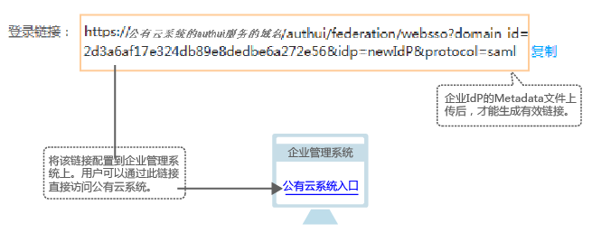

# 配置页面单点登录<a name="ZH-CN_TOPIC_0111879400"></a>

将身份提供商的登录链接配置到企业管理系统上，企业用户通过企业IdP认证后即可访问本系统。

## 前提条件<a name="section532423118535"></a>

已创建身份提供商，并验证身份提供商的登录链接可以正常使用。

## 操作步骤<a name="section4342101645419"></a>

1.  在系统首页，单击“控制台“。
2.  单击右上方登录的用户，在下拉列表中选择“统一身份认证“。
3.  在左侧导航窗格中，单击“身份提供商“。
4.  单击目标身份提供商列表右侧的“查看“。
5.  单击“登录链接“右侧的“复制“。
6.  在企业管理系统页面按“F12“将如下内容配置在页面上。

    ```
    <a href="<登录链接>"> 系统入口 </a>
    ```

    **图 1**  配置入口模型<a name="fig41120284164022"></a>  
    

    用户登录企业管理系统后通过单击“系统入口“可以直接访问本系统。


