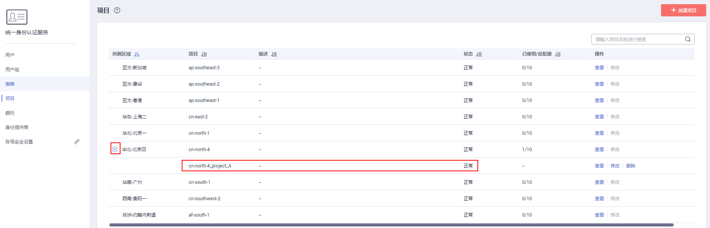
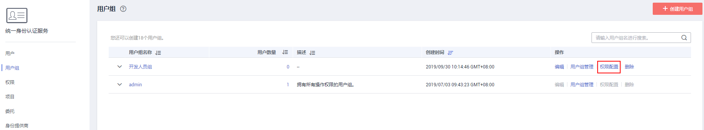
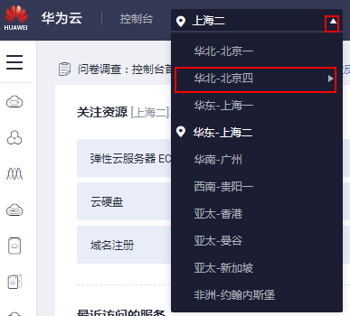

# 项目

华为云的每个区域默认对应一个项目，这个项目由系统预置，用来隔离物理区域间的资源（计算资源、存储资源和网络资源），以区域默认项目为单位进行授权，IAM用户可以访问您账号中该区域的所有资源。

如果您希望进行更加精细的权限控制，可以在区域默认的项目中创建子项目，并在子项目中购买资源，然后以子项目为单位进行授权，使得IAM用户仅能访问特定子项目中的资源，使得资源的权限控制更加精确。

本章描述的IAM项目与企业项目不同，具体内容请参见：[IAM项目和企业项目的区别](https://support.huaweicloud.com/iam_faq/iam_01_0606.html)。

**图 1**  项目隔离模型  

> **说明：**   
>项目中的资源不能转移。  

## 创建项目

1.  在统一身份认证服务的左侧导航窗格中，单击“项目\>创建项目“。

      

2.  在“所属区域“下拉列表中选择需要创建子项目的区域。
3.  输入“项目名称“。

    > **说明：**   
    >-   项目名称的格式为：区域默认项目名称\_子项目名称，区域默认项目名称不允许修改。  
    >-   项目名称可以由字母、数字、下划线（\_）、中划线（-）组成。“区域名称\_项目名称”的总长度不能大于64个字符。  

4.  （可选）输入“描述“。
5.  单击“确定“，项目列表中显示新创建的项目。

    

## 基于项目给用户组授权

以子项目为单位进行授权，使得IAM用户仅能访问特定子项目中的资源，使得资源的权限控制更加精确。

1.  在用户组列表中，单击右侧的“权限配置”。

    

2.  在用户组权限页签中，单击列表左上方的“配置权限”。

    

3.  选择作用范围。此处选择区域级项目，则还需要在下拉框中选择需要授权的项目。
4.  选择权限，单击“确定”，完成授权。

    > **说明：**   
    >更多有关用户组授权的内容，请参见[创建用户组并授权](创建用户组并授权.md)。  

## 切换项目或区域

1.  登录华为云，在右上角单击“控制台”。

    

2.  登录后需要先切换区域或项目，才能访问并使用授权的云服务，否则系统将提示没有权限。

    

