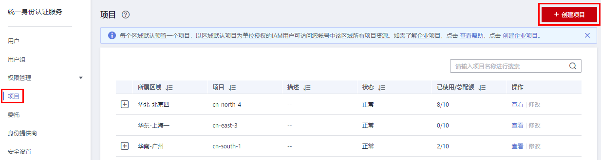
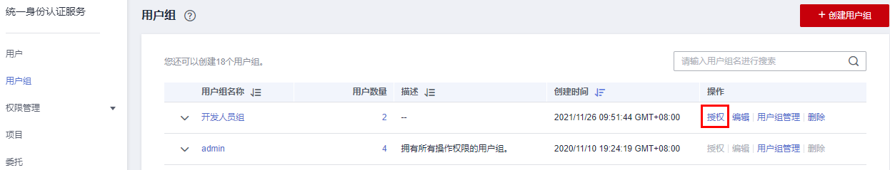

# 项目

华为云的每个区域默认对应一个项目，这个项目由系统预置，用来隔离物理区域间的资源（计算资源、存储资源和网络资源），以区域默认单位为项目进行授权，IAM用户可以访问您帐号中该区域的所有资源。

如果您希望进行更加精细的权限控制，可以在区域默认的项目中创建子项目，并在子项目中购买资源，然后以子项目为单位进行授权，使得IAM用户仅能访问特定子项目中的资源，使得资源的权限控制更加精确。

本章描述的IAM项目与企业项目不同，具体内容请参见：[IAM项目和企业项目的区别](https://support.huaweicloud.com/iam_faq/iam_01_0606.html)。

**图 1**  项目隔离模型  

> **说明：** 
>-   IAM项目中的资源不能转移。
>-   如果您已开通企业项目，将不支持创建IAM项目。

## 创建项目

1.  在统一身份认证服务的左侧导航窗格中，选择“项目”页签，单击“创建项目“。

    **图 2**  创建项目  
    

2.  在“所属区域“下拉列表中选择需要创建子项目的区域。
3.  输入“项目名称“。

    > **说明：** 
    >-   项目名称的格式为：区域默认项目名称\_子项目名称，区域默认项目名称不允许修改。
    >-   项目名称可以由字母、数字、下划线（\_）、中划线（-）组成。“区域名称\_项目名称”的总长度不能大于64个字符。

4.  （可选）输入“描述“。
5.  单击“确定“，项目列表中显示新创建的项目。

## 基于项目给用户组授权

以子项目为单位进行授权，使得IAM用户仅能访问特定子项目中的资源，使得资源的权限控制更加精确。

1.  在用户组列表中，单击用户组右侧的“授权”，进入授权页面。

    **图 3**  权限配置  
    

2.  在授权页面中，勾选需要授予用户组的区域级项目权限，并单击“下一步”。
3.  选择作用范围。此处选择区域项目，则还需要选择待授权的项目。
4.  单击“确定”，完成授权。

    > **说明：** 
    >更多有关用户组授权的内容，请参见[创建用户组并授权](创建用户组并授权.md)。

## 切换项目或区域

登录后需要先切换区域或项目，才能访问并使用授权的云服务，否则系统将提示没有权限。全局区域服务无需切换。

1.  登录华为云控制台。
2.  进入具体的云服务页面，若云服务为项目级服务，则点击页面左上角下拉框，选择区域。

    **图 4**  切换区域或项目  
    

